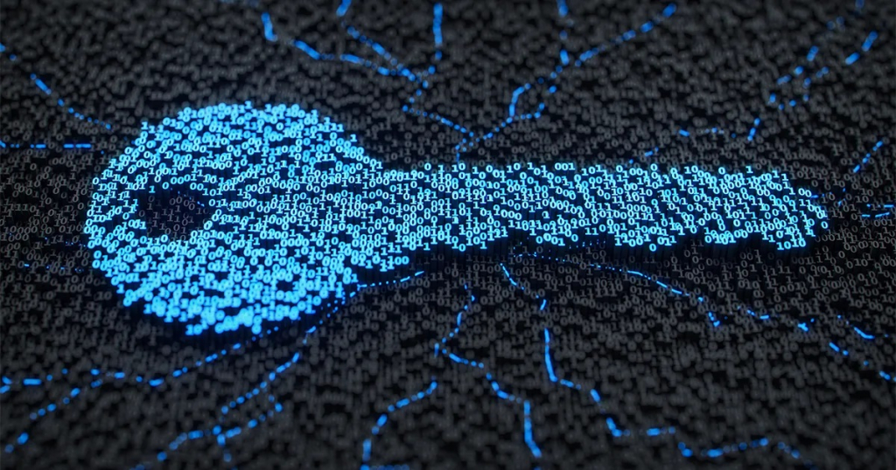
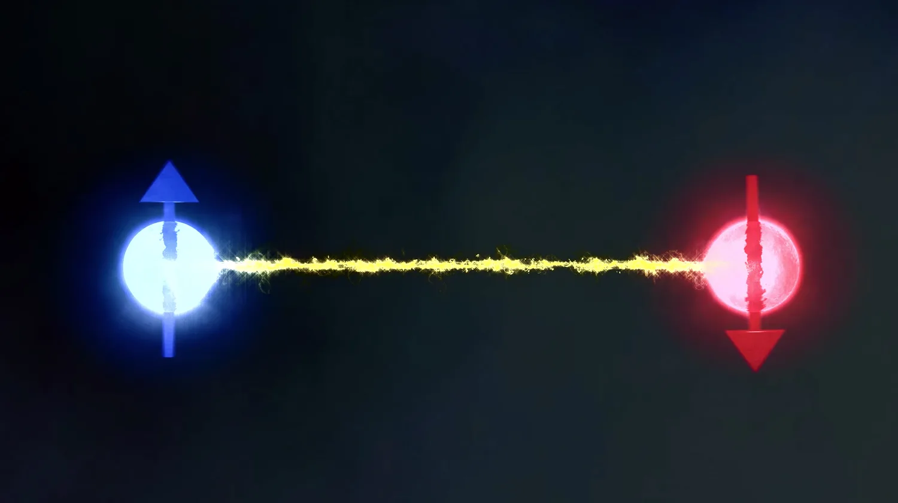

## Квантовое шифрование. Квантовая передача информации.

---

# Введение
Квантовая криптография – это подраздел криптографии, который использует принципы квантовой механики для обеспечения безопасности при передаче информации. Основывается на математике.

---

# Проблемы

1. Атаки со стороны мощных компьютеров.
2. Методы криптографии могут быть нарушены с помощью квантовых алгоритмов.
3. Требуют высоких технологий и значительных ресурсов.
4. Отсутствие общепринятых стандартов.

---

## Цели

1. Создание новых алгоритмов.
2. Оценка существующих криптографических систем.
3. Создание протоколов квантовой передачи информации.
4. Анализ практической применимости.

---

# Гипотезы

1. Квантовое шифрование обеспечивает более высокий уровень безопасности.
2. Квантовая передача информации может быть реализована в реальных условиях.
3. Более сложные квантовые алгоритмы шифрования будут более устойчивыми к атакам со стороны квантовых компьютеров.

---

# Алгоритм работы квантовой криптографии

---

# Достоинства

1. Обеспечивает безопасность.
2. Позволяет безопасно распространять ключи шифрования, гарантируя безопасный обмен ключами.
3. Неуязвима перед потенциальными достижениями в области квантовых вычислений.
4. Гарантирует, что отправитель и получатель, а также любые посредники могут безопасно аутентифицировать друг друга.

---

# Недостатки

1. Ограничены максимальным расстоянием.
2. Требуется сложное и высокочувствительное оборудование.
3. Высокая стоимость.
4. Не защищена от всех возможных атак.
5. Любая компрометация в инфраструктуре может подорвать гарантии безопасности.
6. Не совместима с существующими классическими криптографическими системами.

---

# Будущее квантовой криптографии

Как и со всеми новыми технологиями, будущее квантовой криптографии также будет сопряжено с вызовами и преградами. Необходимо разработать и внедрить стандарты квантовой криптографии, чтобы обеспечить совместимость и безопасность систем.

---

# Вывод 

Квантовая криптография является новым подходом к обеспечению безопасности информации, который основан на принципах квантовой механики. Она предлагает новые методы шифрования и передачи данных, которые потенциально более устойчивы к атакам и взлому, чем классическая криптография.

---

# Литература

1. Квантовая криптография / шифрование [Электронный ресурс]: TAdviser. URL: https://www.tadviser.ru/index.php/Статья:Квантовая_криптография_(шифрование) (дата обращения: 01.07.2023).
2. Quantum Cryptography: An Overview of the Future of Encryption. URL: https://cybertalents.com/blog/quantum-cryptography (дата обращения: 04.07.2023).
3. BB84 [Электронный ресурс]: URL: https://ru.wikipedia.org/wiki/BB84 (дата обращения 04.07.2023).

---

