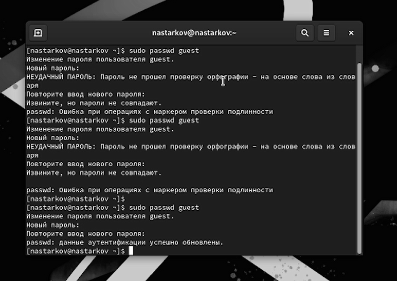
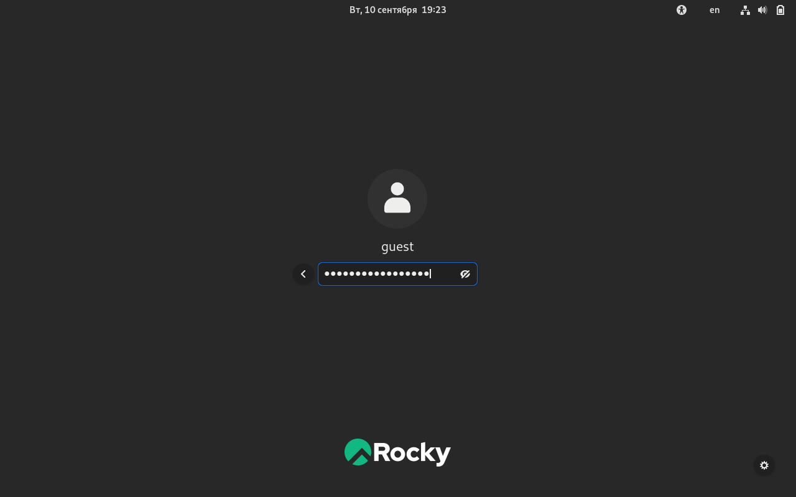
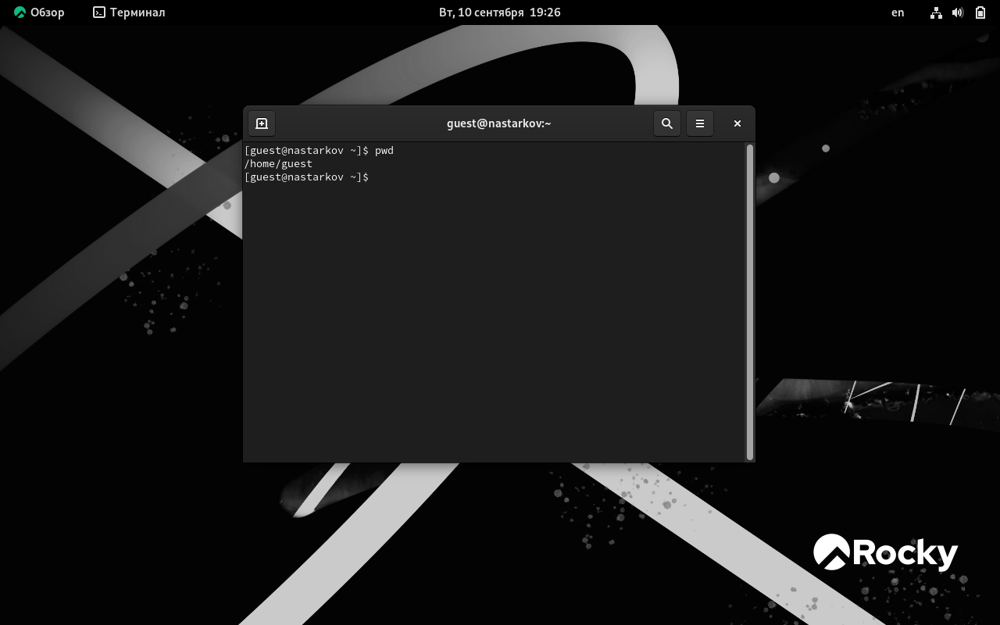
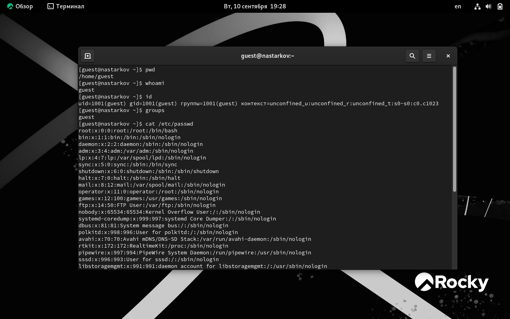
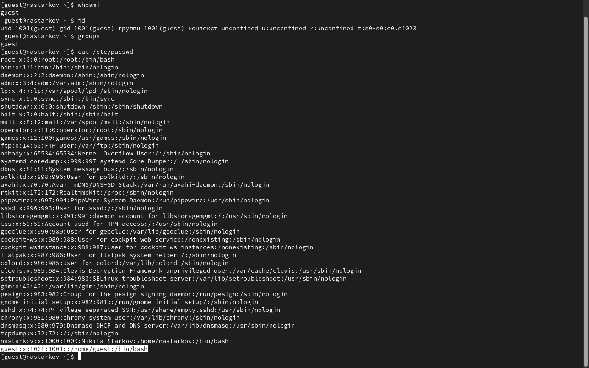
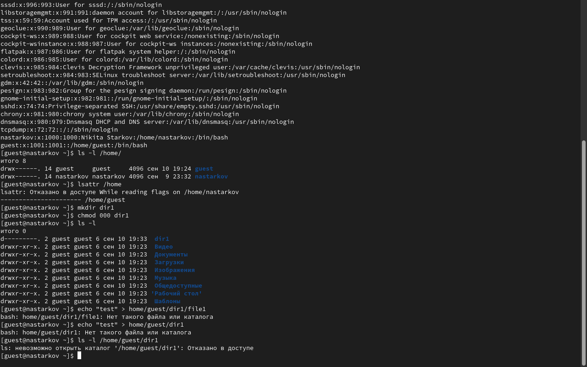
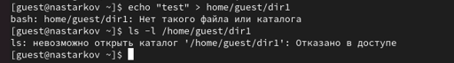

---
## Front matter
lang: ru-RU
title: Презентация к лабораторной работе №2
author: Старков Н.А
group: НПМбд-02-21

## Formatting
toc: false
slide_level: 2
theme: metropolis
header-includes: 
 - \metroset{progressbar=frametitle,sectionpage=progressbar,numbering=fraction}
 - '\makeatletter'
 - '\beamer@ignorenonframefalse'
 - '\makeatother'
aspectratio: 43
section-titles: true
---

# Презентация к лабораторной работе №2

# Цель работы

Получение практических навыков работы в консоли с атрибутами файлов, закрепление теоретических основ дискреционного разграничения доступа в современных системах с открытым кодом на базе ОС Linux.

# Выполнение работы

## Создание пользователя

## Вход в систему

## Команда PWD

## Имя пользователя

## Просмотр файла командой cat

## Просмотр существующих директорий, создание нового каталога, снятие значений с директории dir1

## Проверка работы команды echo

# Вывод
В ходе выполнения лабораторной работы №2 получили практические навыки работы в консоли с атрибутами файлов, закрепили теоретические основы дискреционного разграничения доступа в современных системах с открытым кодом на базе ОС Linux.

