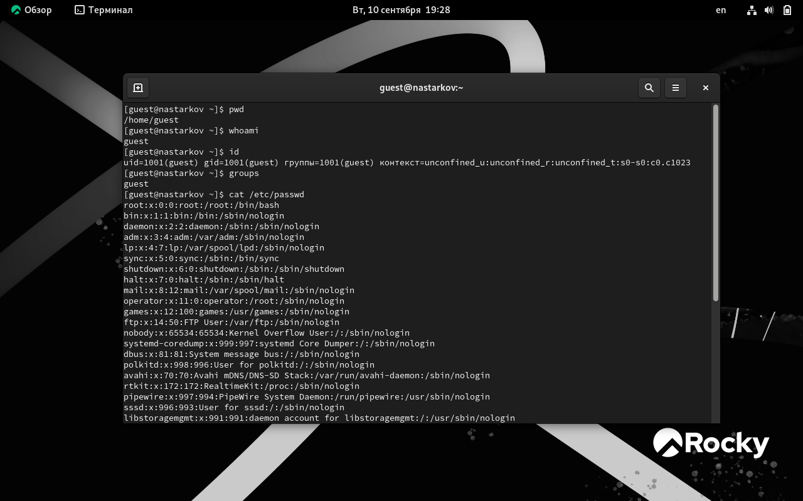
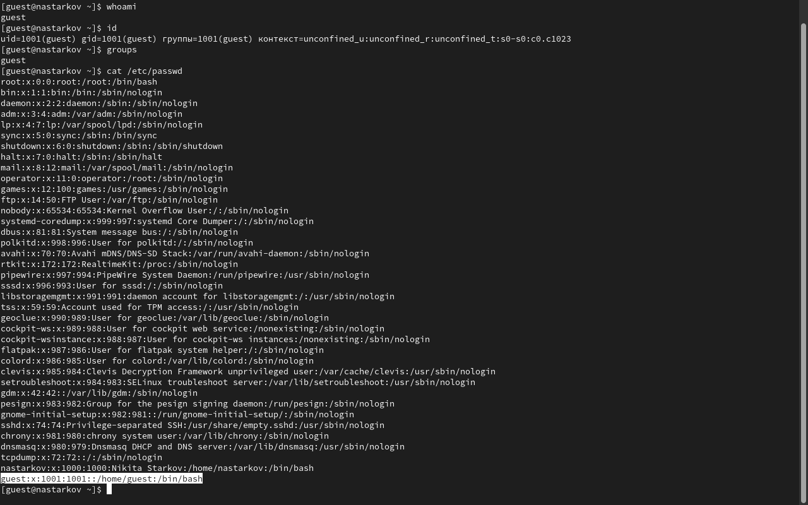
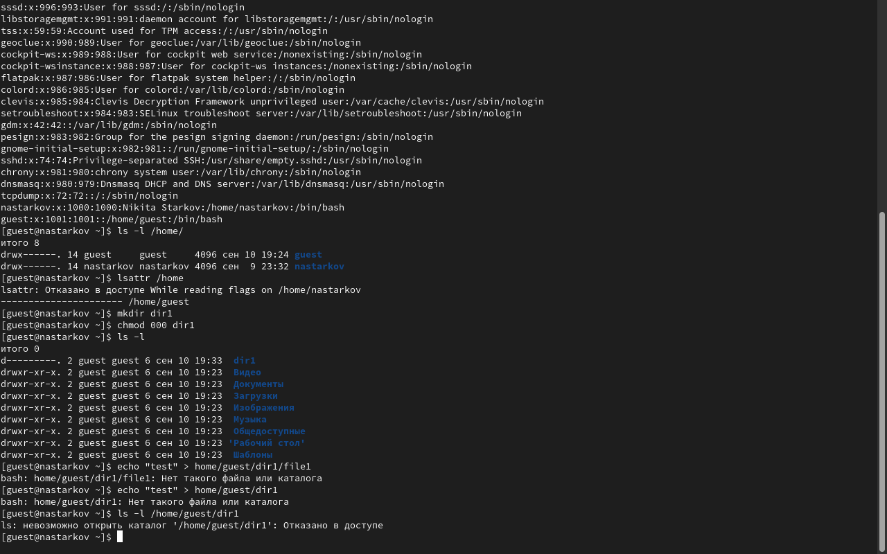
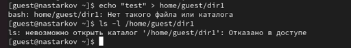

# **Отчет к лабораторной работе №2**
## **Common information**
discipline: Основы информационной безопасности  
group: НПМбд-02-21  
author: Старков Н.А.
---
---
## **Цель работы**
Получение практических навыков работы в консоли с атрибутами файлов, закрепление теоретических основ дискреционного разграничения доступа в современных системах с открытым кодом на базе ОС Linux.

## **Выполнение работы**

1) В установленной при выполнении предыдущей лабораторной работы операционной системе cоздали учётную запись пользователя guest (использую учётную запись администратора):
- с помощью команды sudo useradd guest инициировали добавление нового пользователя в систему;
- с помощью команды passwd guest задали пароль.

2) Вошли в систему от имени guest.

3) Определили директорию, в которой находимся, командой pwd

4) Уточнили имя пользователя командой whoami

5) Просмотрели файл командой cat /etc/passwd. Определили uid и gid пользователя (они равны 1001). Найденные значения совпадают с тем, что было в предыдущих пунктах. 

6) Определили существующие в системе директории командой ls -l /home/. Командой lsattr /home проверили, какие расширенные атрибуты установлены на поддиректориях, находящихся в директории /home. Получили отказано в доступе.

Командой mkdir создали директорию dir1. Сняли с директории dir1 все значения командой chmod 000 dir1. Проверили правильность выполнения команды ls -l

7) Попытались создать в директории dir1 файл file1 командой echo "test" > /home/guest/dir1/file1. Этого сделать не удалось.
Командой ls -l /home/guest/dir1 оценили, как сообщение об ошибке отразилось на создании файла 

8) Заполним таблицу "Установленные права и разрешённые действия". Нужно заполнить 64 ячейки.

Создание файла: echo”text” > /home/guest/dir1/file2. Удаление файла: rm -r /home/guest/dir1/file1. Запись в файл: echo”textnew” > /home/guest/dir1/file1. Чтение файла: cat /home/guest/dir1/file1. Смена директории: cd dir1. Просмотр файлов в директории: ls dir1. Переименование файла: mv /home/guest/dir1/file1 filenew. Смена атрибутов файла: chattr -a /home/guest/dir1/file1.

| Права директории | Права файла | Создание файла | Удаление файла | Запись в файл | Чтение файла | Смена директории | Просмотр файлов в директории | Переименование файла | Смена атрибутов файла |
|------------------|-------------|----------------|----------------|---------------|--------------|------------------|------------------------------|----------------------|-----------------------|
| d (000)          | (000)       | -              | -              | -             | -            | -                | -                            | -                    | -                     |
| d –x (100)       | (000)       | -              | -              | -             | -            | +                | -                            | -                    | -                     |
| d -w- (200)      | (000)       | -              | -              | -             | -            | -                | -                            | -                    | -                     |
| d -wx (300)      | (000)       | +              | +              | -             | -            | +                | -                            | +                    | -                     |
| d r– (400)       | (000)       | -              | -              | -             | -            | -                | +                            | -                    | -                     |
| d r-x (500)      | (000)       | -              | -              | -             | -            | +                | +                            | -                    | -                     |
| d rw- (600)      | (000)       | -              | -              | -             | -            | -                | +                            | -                    | -                     |
| d rwx (700)      | (000)       | +              | +              | -             | -            | +                | +                            | +                    | -                     |
|------------------|-------------|----------------|----------------|---------------|--------------|------------------|------------------------------|----------------------|-----------------------|
| d (000)          | (100)       | -              | -              | -             | -            | -                | -                            | -                    | -                     |
| d –x (100)       | (100)       | -              | -              | -             | -            | +                | -                            | -                    | -                     |
| d -w- (200)      | (100)       | -              | -              | -             | -            | -                | -                            | -                    | -                     |
| d -wx (300)      | (100)       | +              | +              | -             | -            | +                | -                            | +                    | -                     |
| d r– (400)       | (100)       | -              | -              | -             | -            | -                | +                            | -                    | -                     |
| d r-x (500)      | (100)       | -              | -              | -             | -            | +                | +                            | -                    | -                     |
| d rw- (600)      | (100)       | -              | -              | -             | -            | -                | +                            | -                    | -                     |
| d rwx (700)      | (100)       | +              | +              | -             | -            | +                | +                            | +                    | -                     |
|------------------|-------------|----------------|----------------|---------------|--------------|------------------|------------------------------|----------------------|-----------------------|
| d (000)          | (200)       | -              | -              | -             | -            | -                | -                            | -                    | -                     |
| d –x (100)       | (200)       | -              | -              | +             | -            | +                | -                            | -                    | -                     |
| d -w- (200)      | (200)       | -              | -              | -             | -            | -                | -                            | -                    | -                     |
| d -wx (300)      | (200)       | +              | +              | +             | -            | +                | -                            | +                    | -                     |
| d r– (400)       | (200)       | -              | -              | -             | -            | -                | +                            | -                    | -                     |
| d r-x (500)      | (200)       | -              | -              | +             | -            | +                | +                            | -                    | -                     |
| d rw- (600)      | (200)       | -              | -              | -             | -            | -                | +                            | -                    | -                     |
| d rwx (700)      | (200)       | +              | +              | +             | -            | +                | +                            | +                    | -                     |
|------------------|-------------|----------------|----------------|---------------|--------------|------------------|------------------------------|----------------------|-----------------------|
| d (000)          | (300)       | -              | -              | -             | -            | -                | -                            | -                    | -                     |
| d –x (100)       | (300)       | -              | -              | +             | -            | +                | -                            | -                    | -                     |
| d -w- (200)      | (300)       | -              | -              | -             | -            | -                | -                            | -                    | -                     |
| d -wx (300)      | (300)       | +              | +              | -             | +            | +                | -                            | +                    | -                     |
| d r– (400)       | (300)       | -              | -              | -             | -            | -                | +                            | -                    | -                     |
| d r-x (500)      | (300)       | -              | -              | +             | -            | +                | +                            | -                    | -                     |
| d rw- (600)      | (300)       | -              | -              | -             | -            | -                | +                            | -                    | -                     |
| d rwx (700)      | (300)       | +              | +              | +             | -            | +                | +                            | +                    | -                     |
|------------------|-------------|----------------|----------------|---------------|--------------|------------------|------------------------------|----------------------|-----------------------|
| d (000)          | (400)       | -              | -              | -             | -            | -                | -                            | -                    | -                     |
| d –x (100)       | (400)       | -              | -              | -             | +            | +                | -                            | -                    | +                     |
| d -w- (200)      | (400)       | -              | -              | -             | -            | -                | -                            | -                    | -                     |
| d -wx (300)      | (400)       | +              | +              | -             | +            | +                | -                            | +                    | +                     |
| d r– (400)       | (400)       | -              | -              | -             | -            | -                | +                            | -                    | -                     |
| d r-x (500)      | (400)       | -              | -              | -             | +            | +                | +                            | -                    | +                     |
| d rw- (600)      | (400)       | -              | -              | -             | -            | -                | +                            | -                    | -                     |
| d rwx (700)      | (400)       | +              | +              | -             | +            | +                | +                            | +                    | +                     |
|------------------|-------------|----------------|----------------|---------------|--------------|------------------|------------------------------|----------------------|-----------------------|
| d (000)          | (500)       | -              | -              | -             | -            | -                | -                            | -                    | -                     |
| d –x (100)       | (500)       | -              | -              | -             | +            | +                | -                            | -                    | +                     |
| d -w- (200)      | (500)       | -              | -              | -             | -            | -                | -                            | -                    | -                     |
| d -wx (300)      | (500)       | +              | +              | -             | +            | +                | -                            | +                    | +                     |
| d r– (400)       | (500)       | -              | -              | -             | -            | -                | +                            | -                    | -                     |
| d r-x (500)      | (500)       | -              | -              | -             | +            | +                | +                            | -                    | +                     |
| d rw- (600)      | (500)       | -              | -              | -             | -            | -                | +                            | -                    | -                     |
| d rwx (700)      | (500)       | +              | +              | -             | +            | +                | +                            | +                    | +                     |
|------------------|-------------|----------------|----------------|---------------|--------------|------------------|------------------------------|----------------------|-----------------------|
| d (000)          | (600)       | -              | -              | -             | -            | -                | -                            | -                    | -                     |
| d –x (100)       | (600)       | -              | -              | +             | +            | +                | -                            | -                    | +                     |
| d -w- (200)      | (600)       | -              | -              | -             | -            | -                | -                            | -                    | -                     |
| d -wx (300)      | (600)       | +              | +              | +             | +            | +                | -                            | +                    | +                     |
| d r– (400)       | (600)       | -              | -              | -             | -            | -                | +                            | -                    | -                     |
| d r-x (500)      | (600)       | -              | -              | +             | +            | +                | +                            | -                    | +                     |
| d rw- (600)      | (600)       | -              | -              | -             | -            | -                | +                            | -                    | -                     |
| d rwx (700)      | (600)       | +              | +              | +             | +            | +                | +                            | +                    | +                     |
|------------------|-------------|----------------|----------------|---------------|--------------|------------------|------------------------------|----------------------|-----------------------|
| d (000)          | (700)       | -              | -              | -             | -            | -                | -                            | -                    | -                     |
| d –x (100)       | (700)       | -              | -              | +             | +            | +                | -                            | -                    | +                     |
| d -w- (200)      | (700)       | -              | -              | -             | -            | -                | -                            | -                    | -                     |
| d -wx (300)      | (700)       | +              | +              | +             | +            | +                | -                            | +                    | +                     |
| d r– (400)       | (700)       | -              | -              | -             | -            | -                | +                            | -                    | -                     |
| d r-x (500)      | (700)       | -              | -              | +             | +            | +                | +                            | -                    | +                     |
| d rw- (600)      | (700)       | -              | -              | -             | -            | -                | +                            | -                    | -                     |
| d rwx (700)      | (700)       | +              | +              | +             | +            | +                | +                            | +                    | +                     |

9) Заполним таблицу "Минимальные права для совершения операций".

| Операция               | Минимальные права на директорию | Минимальные права на файл |
|------------------------|---------------------------------|---------------------------|
| Создание файла         | d -wx (300)                     | (000)                     |
| Удаление файла         | d -wx (300)                     | (000)                     |
| Чтение файла           | d –x (100)                      | (400)                     |
| Запись в файл          | d –x (100)                      | (200)                     |
| Переименование файла   | d -wx (300)                     | (000)                     |
| Создание поддиректории | d -wx (300)                     | (000)                     |
| Удаление поддиректории | d -wx (300)                     | (000)                     |

## **Вывод**
В ходе выполнения лабораторной работы №2 получили практические навыки работы в консоли с атрибутами файлов, закрепили теоретические основы дискреционного разграничения доступа в современных системах с открытым кодом на базе ОС Linux.

