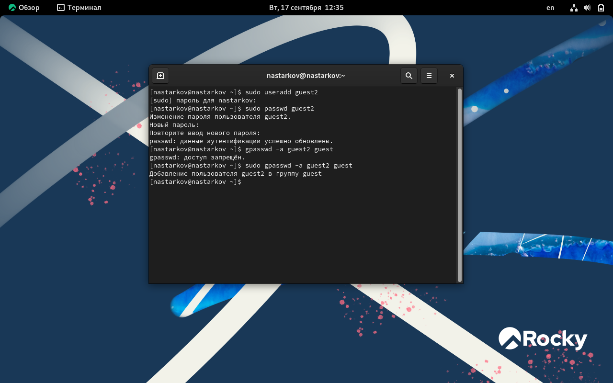
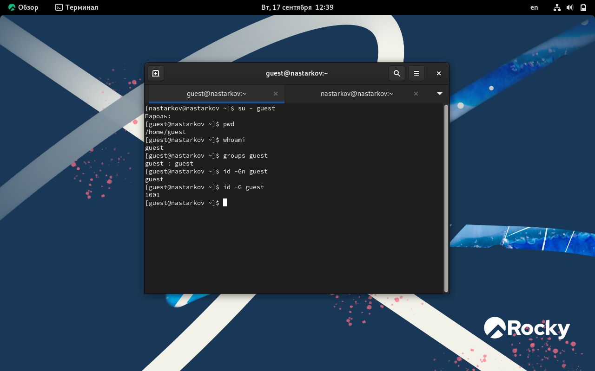
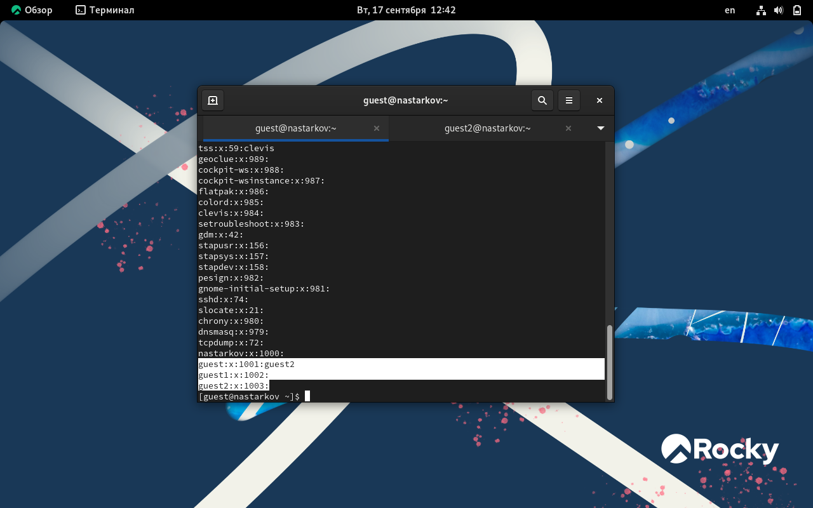
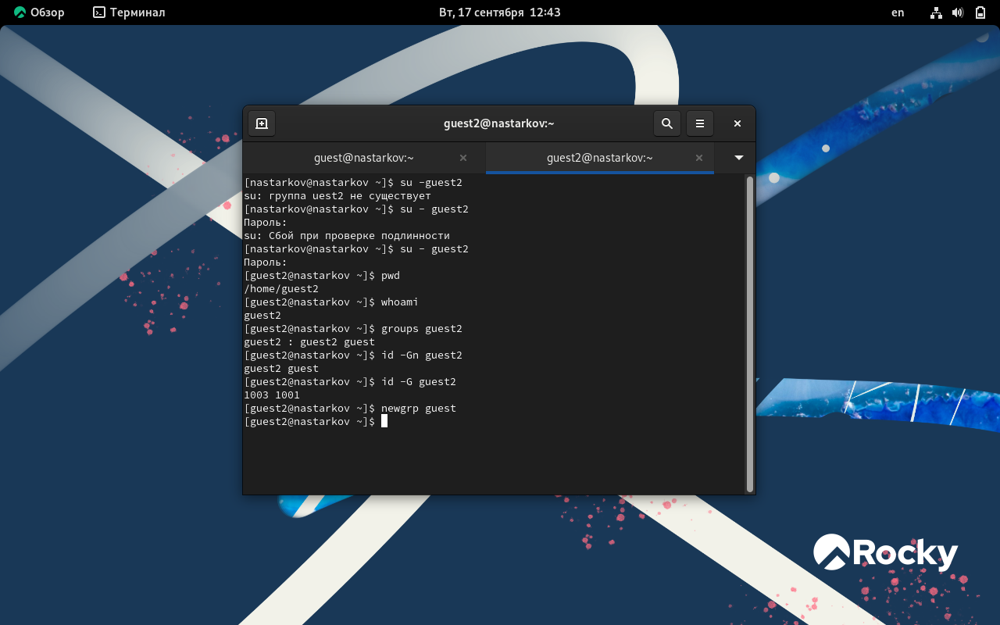
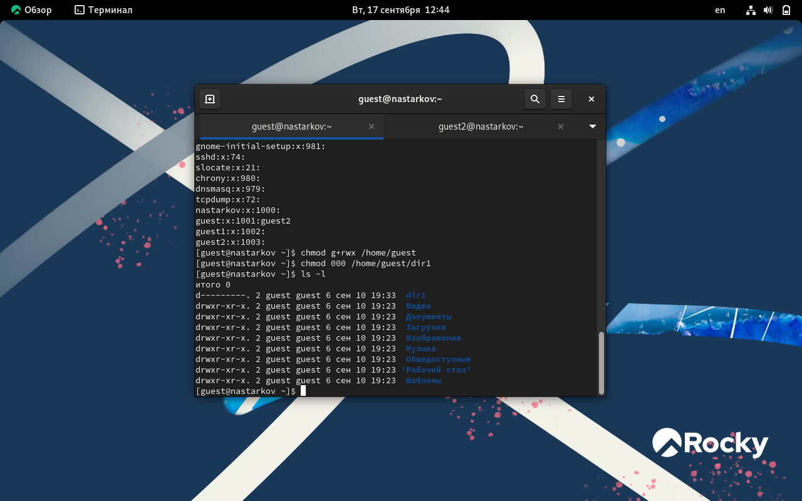

# **Отчет к лабораторной работе №3**
## **Common information**
discipline: Основы информационной безопасности  
group: НПМбд-02-21  
author: Старков Н.А.
---
---
## **Цель работы**
Получение практических навыков работы в консоли с атрибутами файлов для групп пользователей.

## **Выполнение работы**

1) Добавляем пользователя guest2
- с помощью команды sudo useradd guest инициировали добавление нового пользователя в систему;
- с помощью команды passwd guest задали пароль.

Также добавили нового пользователя в группу с пользователем guest с помощью команды gpasswd -a guest2 guest

2) Осуществили вход в двух консолях от имени guest и guest2, используя команду su - guest. Далее применили команды pwd, whoami, groups guest, id -Gn <имя пользователя> и id -G <имя пользователя>, чтобы узнать более детальную информацию об этих двух пользователях

3) Далее применили команды cat /etc/group, чтобы сравнить полученную информацию с содержимым файла. Данные совпадают

4) Применили команды newgrp для регистрации Пользователя guest2 в группе guest

5) От имени пользователя guest меняем права директории /home/guest, разрешив все действия для пользователей группы командой “chmod g+rwx /home/guest”. От имени этого же пользователя снимаем с директории /home/guest/dir1 все атрибуты командой “chmod 000 dir1” и проверяем правильность снятия атрибутов командой “ls -l”

6) Теперь заполним таблицу «Установленные права и разрешённые действия», меняя атрибуты у директории и файла от имени пользователя guest и делая проверку от пользователя guest2.
Создание файла: “echo”text” > /home/guest/dir1/file2”
Удаление файла: “rm -r /home/guest/dir1/file1”
Запись в файл: “echo”textnew” > /home/guest/dir1/file1”
Чтение файла: “cat /home/guest/dir1/file1”
Смена директории: “cd /home/guest/dir1”
Просмотр файлов в директории: “ls /home/guest/dir1”
Переименование файла: “mv /home/guest/dir1/file1 filenew”
Смена атрибутов файла: “chattr -a /home/guest/dir1/file1”

| Права директории | Права файла | Создание файла | Удаление файла | Запись в файл | Чтение файла | Смена директории | Просмотр файлов в директории | Переименование файла | Смена атрибутов файла |
|------------------|-------------|----------------|----------------|---------------|--------------|------------------|------------------------------|----------------------|-----------------------|
| d (000)          | (000)       | -              | -              | -             | -            | -                | -                            | -                    | -                     |
| d –x (010)       | (000)       | -              | -              | -             | -            | +                | -                            | -                    | -                     |
| d -w- (020)      | (000)       | -              | -              | -             | -            | -                | -                            | -                    | -                     |
| d -wx (030)      | (000)       | +              | +              | -             | -            | +                | -                            | +                    | -                     |
| d r– (040)       | (000)       | -              | -              | -             | -            | -                | +                            | -                    | -                     |
| d r-x (050)      | (000)       | -              | -              | -             | -            | +                | +                            | -                    | -                     |
| d rw- (060)      | (000)       | -              | -              | -             | -            | -                | +                            | -                    | -                     |
| d rwx (070)      | (000)       | +              | +              | -             | -            | +                | +                            | +                    | -                     |
|------------------|-------------|----------------|----------------|---------------|--------------|------------------|------------------------------|----------------------|-----------------------|
| d (000)          | (010)       | -              | -              | -             | -            | -                | -                            | -                    | -                     |
| d –x (010)       | (010)       | -              | -              | -             | -            | +                | -                            | -                    | -                     |
| d -w- (020)      | (010)       | -              | -              | -             | -            | -                | -                            | -                    | -                     |
| d -wx (030)      | (010)       | +              | +              | -             | -            | +                | -                            | +                    | -                     |
| d r– (040)       | (010)       | -              | -              | -             | -            | -                | +                            | -                    | -                     |
| d r-x (050)      | (010)       | -              | -              | -             | -            | +                | +                            | -                    | -                     |
| d rw- (060)      | (010)       | -              | -              | -             | -            | -                | +                            | -                    | -                     |
| d rwx (070)      | (010)       | +              | +              | -             | -            | +                | +                            | +                    | -                     |
|------------------|-------------|----------------|----------------|---------------|--------------|------------------|------------------------------|----------------------|-----------------------|
| d (000)          | (020)       | -              | -              | -             | -            | -                | -                            | -                    | -                     |
| d –x (010)       | (020)       | -              | -              | +             | -            | +                | -                            | -                    | -                     |
| d -w- (020)      | (020)       | -              | -              | -             | -            | -                | -                            | -                    | -                     |
| d -wx (030)      | (020)       | +              | +              | +             | -            | +                | -                            | +                    | -                     |
| d r– (040)       | (020)       | -              | -              | -             | -            | -                | +                            | -                    | -                     |
| d r-x (050)      | (020)       | -              | -              | +             | -            | +                | +                            | -                    | -                     |
| d rw- (060)      | (020)       | -              | -              | -             | -            | -                | +                            | -                    | -                     |
| d rwx (070)      | (020)       | +              | +              | +             | -            | +                | +                            | +                    | -                     |
|------------------|-------------|----------------|----------------|---------------|--------------|------------------|------------------------------|----------------------|-----------------------|
| d (000)          | (030)       | -              | -              | -             | -            | -                | -                            | -                    | -                     |
| d –x (010)       | (030)       | -              | -              | +             | -            | +                | -                            | -                    | -                     |
| d -w- (020)      | (030)       | -              | -              | -             | -            | -                | -                            | -                    | -                     |
| d -wx (030)      | (030)       | +              | +              | +             | +            | +                | -                            | +                    | -                     |
| d r– (040)       | (030)       | -              | -              | -             | -            | -                | +                            | -                    | -                     |
| d r-x (050)      | (030)       | -              | -              | +             | -            | +                | +                            | -                    | -                     |
| d rw- (060)      | (030)       | -              | -              | -             | -            | -                | +                            | -                    | -                     |
| d rwx (070)      | (030)       | +              | +              | +             | +            | +                | +                            | +                    | -                     |
|------------------|-------------|----------------|----------------|---------------|--------------|------------------|------------------------------|----------------------|-----------------------|
| d (000)          | (040)       | -              | -              | -             | -            | -                | -                            | -                    | -                     |
| d –x (010)       | (040)       | -              | -              | -             | +            | +                | -                            | -                    | -                     |
| d -w- (020)      | (040)       | -              | -              | -             | -            | -                | -                            | -                    | -                     |
| d -wx (030)      | (040)       | +              | +              | -             | +            | +                | -                            | +                    | -                     |
| d r– (040)       | (040)       | -              | -              | -             | -            | -                | +                            | -                    | -                     |
| d r-x (050)      | (040)       | -              | -              | -             | +            | +                | +                            | -                    | -                     |
| d rw- (060)      | (040)       | -              | -              | -             | -            | -                | +                            | -                    | -                     |
| d rwx (070)      | (040)       | +              | +              | -             | +            | +                | +                            | +                    | -                     |
|------------------|-------------|----------------|----------------|---------------|--------------|------------------|------------------------------|----------------------|-----------------------|
| d (000)          | (050)       | -              | -              | -             | -            | -                | -                            | -                    | -                     |
| d –x (010)       | (050)       | -              | -              | -             | +            | +                | -                            | -                    | -                     |
| d -w- (020)      | (050)       | -              | -              | -             | -            | -                | -                            | -                    | -                     |
| d -wx (030)      | (050)       | +              | +              | -             | +            | +                | -                            | +                    | -                     |
| d r– (040)       | (050)       | -              | -              | -             | -            | -                | +                            | -                    | -                     |
| d r-x (050)      | (050)       | -              | -              | -             | +            | +                | +                            | -                    | -                     |
| d rw- (060)      | (050)       | -              | -              | -             | -            | -                | +                            | -                    | -                     |
| d rwx (070)      | (050)       | +              | +              | -             | +            | +                | +                            | +                    | -                     |
|------------------|-------------|----------------|----------------|---------------|--------------|------------------|------------------------------|----------------------|-----------------------|
| d (000)          | (060)       | -              | -              | -             | -            | -                | -                            | -                    | -                     |
| d –x (010)       | (060)       | -              | -              | +             | +            | +                | -                            | -                    | -                     |
| d -w- (020)      | (060)       | -              | -              | -             | -            | -                | -                            | -                    | -                     |
| d -wx (030)      | (060)       | +              | +              | +             | +            | +                | -                            | +                    | -                     |
| d r– (040)       | (060)       | -              | -              | -             | -            | -                | +                            | -                    | -                     |
| d r-x (050)      | (060)       | -              | -              | +             | +            | +                | +                            | -                    | -                     |
| d rw- (060)      | (060)       | -              | -              | -             | -            | -                | +                            | -                    | -                     |
| d rwx (070)      | (060)       | +              | +              | +             | +            | +                | +                            | +                    | -                     |
|------------------|-------------|----------------|----------------|---------------|--------------|------------------|------------------------------|----------------------|-----------------------|
| d (000)          | (070)       | -              | -              | -             | -            | -                | -                            | -                    | -                     |
| d –x (010)       | (070)       | -              | -              | +             | +            | +                | -                            | -                    | -                     |
| d -w- (020)      | (070)       | -              | -              | -             | -            | -                | -                            | -                    | -                     |
| d -wx (030)      | (070)       | +              | +              | +             | +            | +                | -                            | +                    | -                     |
| d r– (040)       | (070)       | -              | -              | -             | -            | -                | +                            | -                    | -                     |
| d r-x (050)      | (070)       | -              | -              | +             | +            | +                | +                            | -                    | -                     |
| d rw- (060)      | (070)       | -              | -              | -             | -            | -                | +                            | -                    | -                     |
| d rwx (070)      | (070)       | +              | +              | +             | +            | +                | +                            | +                    | -                     |
|------------------|-------------|----------------|----------------|---------------|--------------|------------------|------------------------------|----------------------|-----------------------|

7) Сравнивая полученную таблицу с таблицей из прошлой лабораторной работы, приходим к выводу, что изменился только последний столбец, позволяющий изменять атрибуты у файла: теперь это сделать невозможно, т.к. у владельца файла и директории нет на это прав (во всех случаях в первой позиции стоят 0). При определенном наборе прав остальные действия выполняются или не выполняются аналогично предыдущей таблице, но теперь как для владельца, так и для группы.

Заполним таблицу «Минимально необходимые права для выполнения операций внутри директории».

| Операция               | Минимальные права на директорию | Минимальные права на файл |
|------------------------|---------------------------------|---------------------------|
| Создание файла         | d -wx (300)                     | (000)                     |
| Удаление файла         | d -wx (300)                     | (000)                     |
| Чтение файла           | d –x (100)                      | (040)                     |
| Запись в файл          | d –x (100)                      | (020)                     |
| Переименование файла   | d -wx (300)                     | (000)                     |
| Создание поддиректории | d -wx (300)                     | (000)                     |
| Удаление поддиректории | d -wx (300)                     | (000)                     |

## **Вывод**
В ходе выполнения лабораторной работы №3 я получил практические навыки работы в консоли с атрибутами файлов для групп пользователей.

