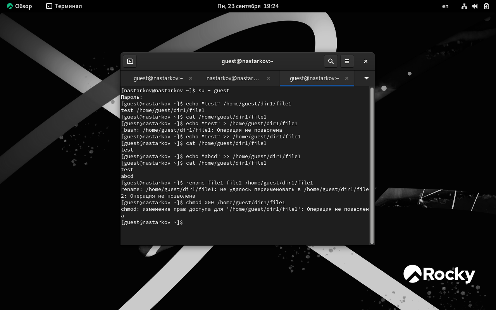
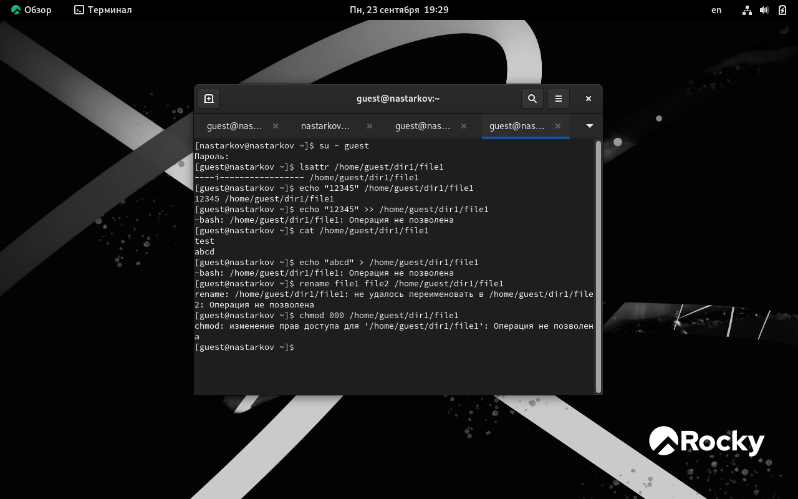

---
## Front matter
lang: ru-RU
title: Презентация к лабораторной работе №4
author: Старков Н.А
group: НПМбд-02-21

## Formatting
toc: false
slide_level: 2
theme: metropolis
header-includes: 
 - \metroset{progressbar=frametitle,sectionpage=progressbar,numbering=fraction}
 - '\makeatletter'
 - '\beamer@ignorenonframefalse'
 - '\makeatother'
aspectratio: 43
section-titles: true
---

# Презентация к лабораторной работе №4

# Цель работы

Получение практических навыков работы в консоли с расширенными атрибутами файлов.

# Выполнение работы

## Определили расширенные атрибуты файла

## Установили рассширенный атрибут от имени суперпользователя

## Проверили правильность установления атрибута

## Поработали с файлом file1

## Сняли расширенный атрибут

## Присвоили атрибут i

## Проверили доступ при работе с новым атрибутом

# Вывод 

В ходе выполнения лабораторной работы №4 я получил практические навыки работы в консоли с расширенными атрибутами файлов.
