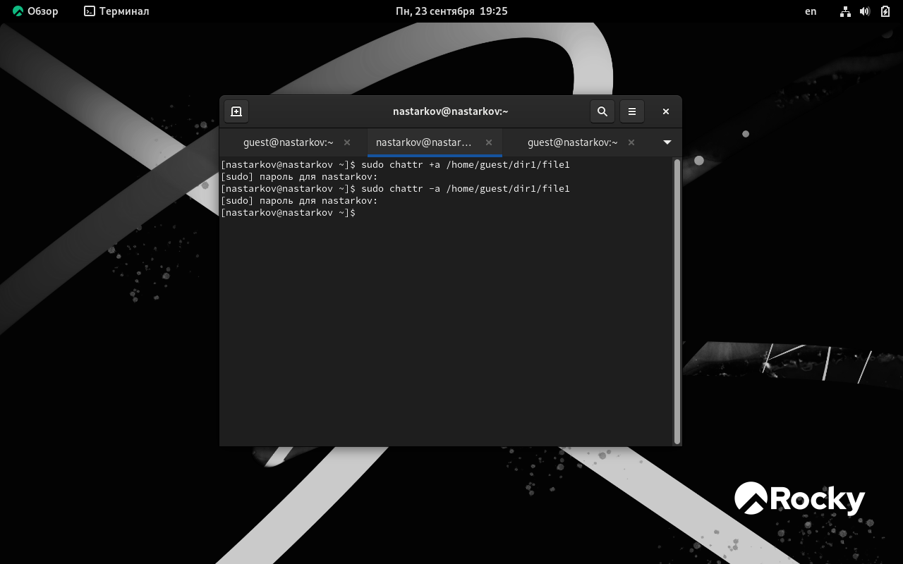

# **Отчет к лабораторной работе №4**
## **Common information**
discipline: Основы информационной безопасности  
group: НПМбд-02-21  
author: Старков Н.А.
---
---
## **Цель работы**
Получение практических навыков работы в консоли с расширенными атрибутами файлов.

## **Выполнение работы**

1) От имени пользователя guest определили расширенные атрибуты файла командой: 

```
lsattr /home/guest/dir1/file1
```

Далее установили права, разрешающие чтение и запись для владельца файла, используя команду 

```
chmod 600 file1
```

После установили на файл /home/guest/dir1/file1 расширенный атрибут a от имени пользователя guest командой:

```
chattr +a /home/guest/dir1/file1
```


2) Повысили свои права с помощью команды su и установили расширенный атрибут a на файл /home/guest/dir1/file1 от имени суперпользователя: 

```
sudo chattr +a /home/guest/dir1/file1
```


3) От пользователя guest проверили правильность установления атрибута:


4) Выполнили дозапись в файл file1 слова «test» командой 

```
echo "test" /home/guest/dir1/file1
```
После этого выполните чтение файла file1 командой

```
cat /home/guest/dir1/file1
```
Убедились, что слово test было успешно записано в file1. Попробовали удалить файл file1 либо стереть имеющуюся в нём информацию командой 

```
echo "abcd" > /home/guest/dirl/file1. 
```

Попробовали переименовать файл. Попробовали установить другие права командой 

```

chmod 000 file1

```

Убедились, что практически везде отказано в доступе.


5) Сняли расширенный атрибут a с файла /home/guest/dirl/file1 от имени суперпользователя командой

```
chattr -a /home/guest/dir1/file1
```



6) Повторили весь тот же процесс, присвоив атрибут i

```
chattr +i /home/guest/dir1/file1
```


7) Убедились, что доступ к командам отличается


## **Вывод**
В ходе выполнения лабораторной работы №4 я получил практические навыки работы в консоли с расширенными атрибутами файлов.

