# **Отчет к лабораторной работе №7**
## **Common information**
discipline: Основы информационной безопасности  
group: НПМбд-02-21  
author: Старков Н.А.
---
---
## **Цель работы**

Освоить на практике применение режима однократного гаммирования.

## **Выполнение работы**

1) Для начала я убедился, что компилятор gcc установлен, используя команду “gcc -v”. Затем отключила систему запретов до очередной перезагрузки системы
командой “sudo setenforce 0”, после чего команда “getenforce” вывела “Permissive”

2) Проверили успешное выполнение команд “whereis gcc” и “whereis g++”

3) Вошли в систему от имени пользователя guest командой “su - guest”. Создали программу simpleid.c командой “touch simpleid.c” и открыла её в редакторе командой “gedit /home/guest/simpleid.c”

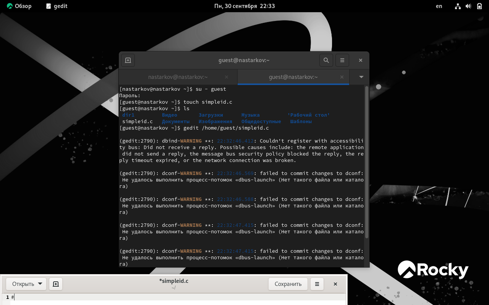

4) Написали код в созданном файле

5) Скомпилировали программу и запустили ее 

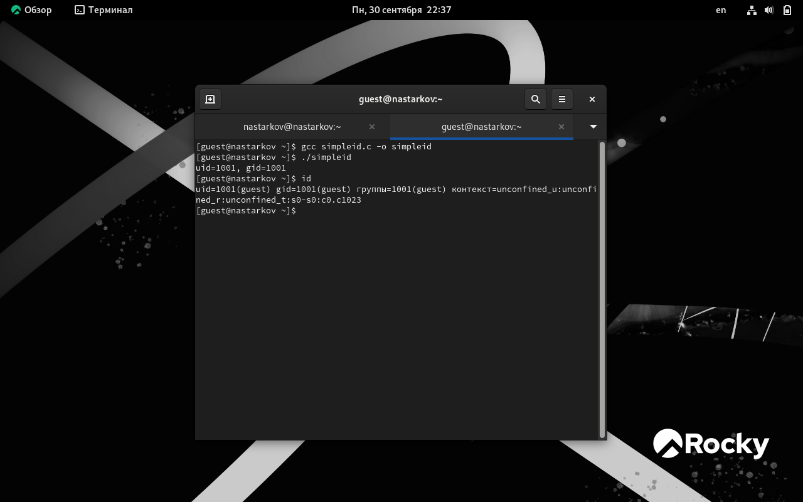

6) Создаем новый файл, там пишем более сложный код, компилируем и запускаем программу.

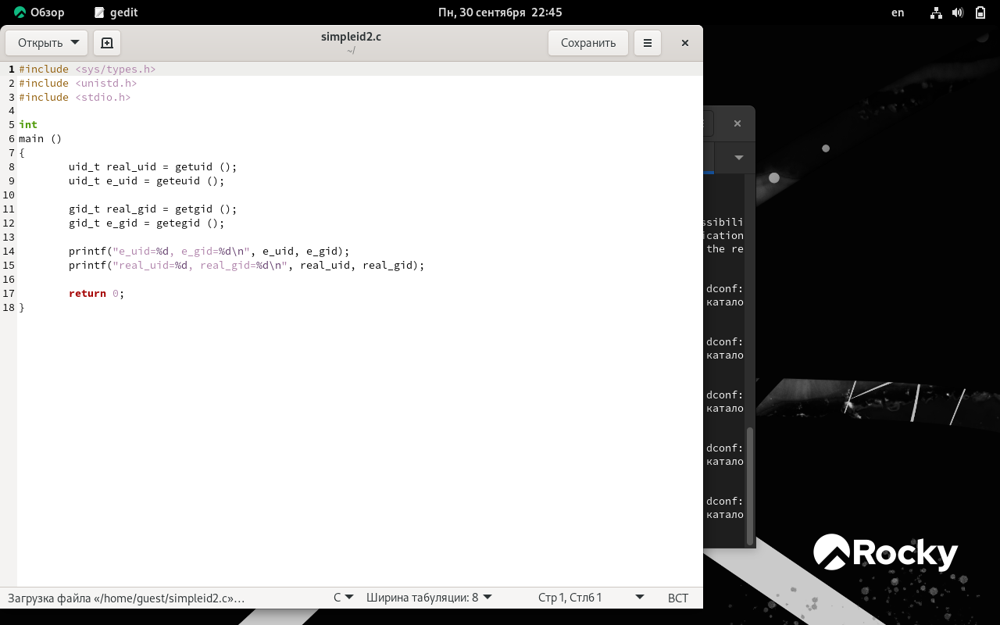

7) От имени суперпользователя выполнили команды “sudo chown root:guest/home/guest/simpleid2” и “sudo chmod u+s /home/guest/simpleid2”, затем выполнили проверку правильности установки новых атрибутов и смены владельца файла simpleid2 командой “sudo ls -l /home/guest/simpleid2”. Этими командами была произведена смена пользователя файла на root и установлен SetUID-бит.

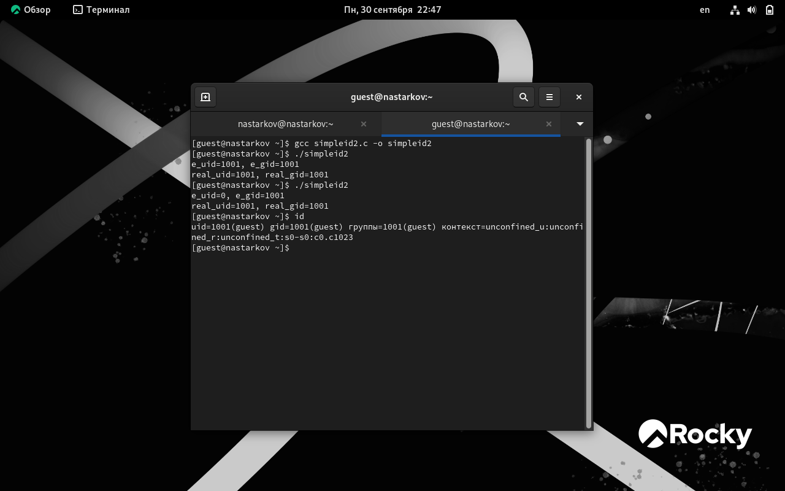

Запустил программы simpleid2 и id. Теперь появились различия в uid

8) Проделал тоже самое относительно SetGID-бита. Также можем заметить различия с предыдущим пунктом.

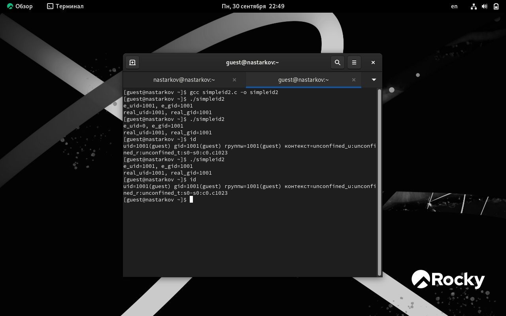

9) Создаем новый файл readfile. Скомпилировали созданную программу командой “gcc readfile.c -o readfile”. Сменили владельца у файла readfile.c командой “sudo chown root:guest/home/guest/readfile.c” и поменяли права так, чтобы только суперпользовательмог прочитать его, а guest не мог, с помощью команды “sudo chmod 700/home/guest/readfile.c”. Теперь убедились, что пользователь guest не может
прочитать файл readfile.c командой “cat readfile.c”, получив отказ в доступе.

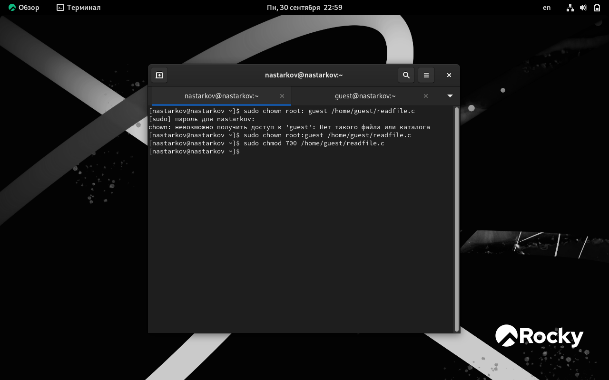

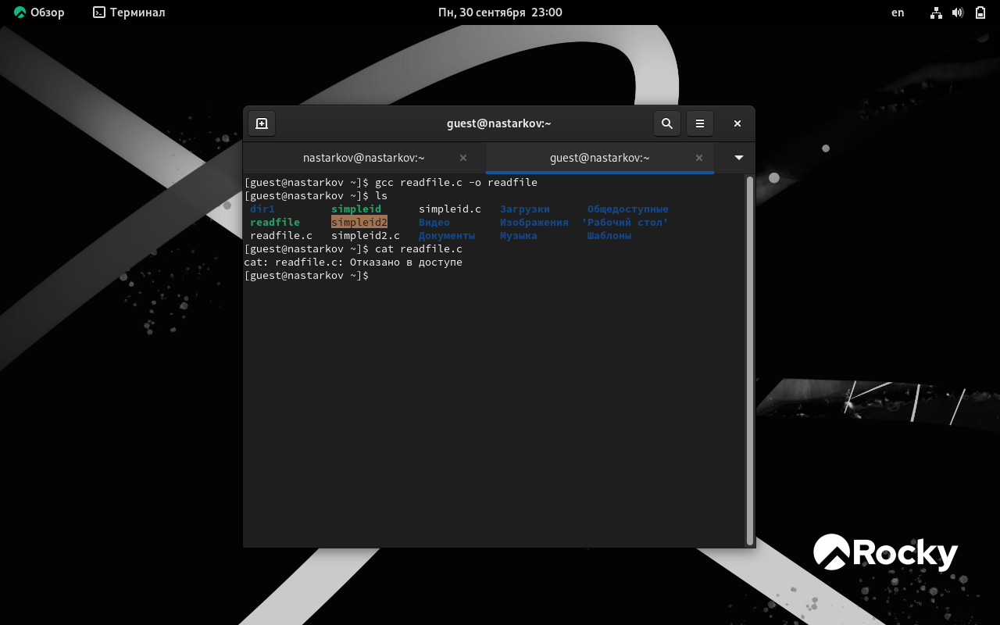

10) Поменяли владельца у программы readfile и устанавила SetUID. Проверили, может ли программа readfile прочитать файл readfile.c командой “./readfile readfile.c”. Прочитать удалось. Аналогично проверили, можно ли прочитать файл /etc/shadow. Прочитать удалось

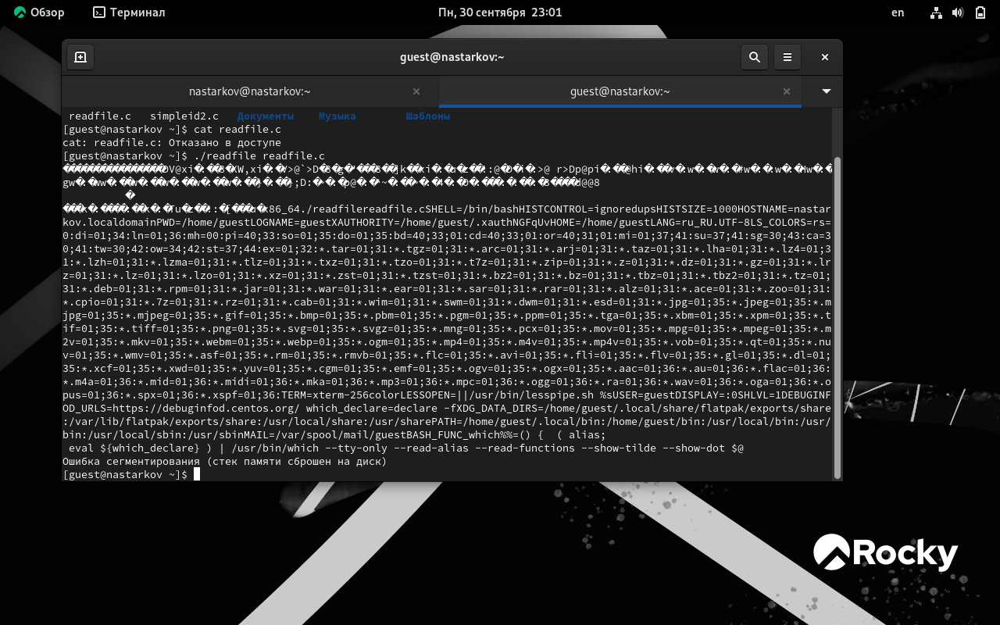

11) Командой “ls -l / | grep tmp” убеждились, что атрибут Sticky на директории /tmp установлен. От имени пользователя guest создали файл file01.txt в директории /tmp со словом test командой “echo”test” > /tmp/file01.txt”. Просмотрели атрибуты у только что созданного файла и разрешаем чтение и запись для категории пользователей “все остальные” командами “ls -l /tmp/file01.txt” и “chmod o+rw
/tmp/file01.txt”

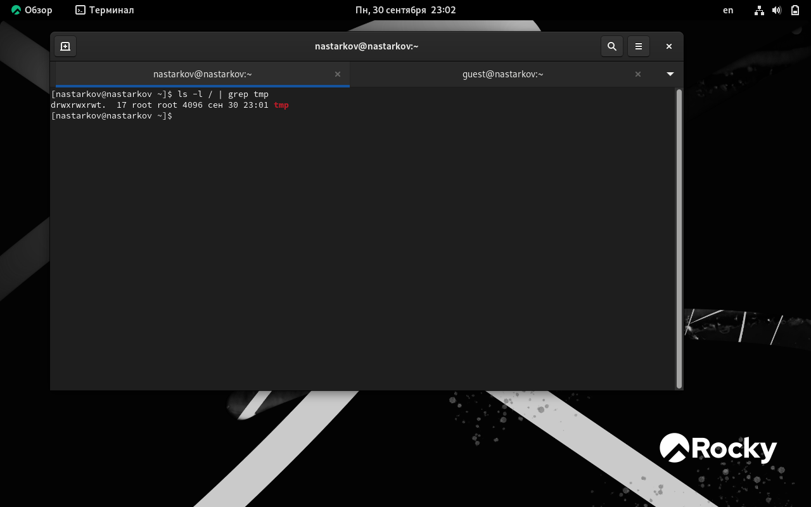

12) От имени пользователя guest2 попробовали прочитать файл командой “cat/tmp/file01.txt” - это удалось. Далее попытались дозаписать в файл слово test2, проверить содержимое файла и записать в файл слово test3, стерев при этом всю имеющуюся в файле информацию - эти операции удалось выполнить только в случае, если еще дополнительно разрешить чтение и запись для группы пользователей командой “chmod g+rw /tmp/file01.txt”. От имени пользователя guest2 попробовала удалить файл - это не удается ни в каком из случаев, возникает ошибка

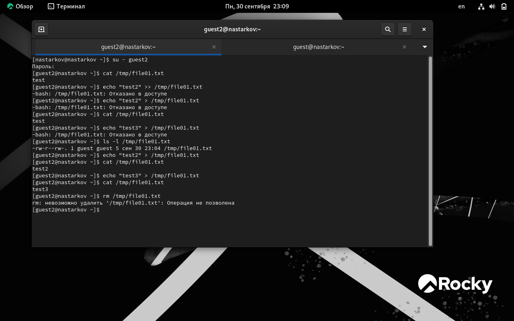

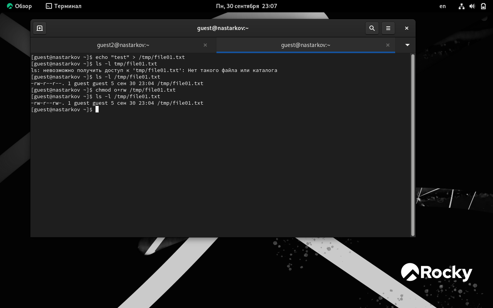

13) Повысили права до суперпользователя командой “su -” и выполнили команду, снимающую атрибут t с директории /tmp “chmod -t /tmp”. После чего покинули режим суперпользователя командой “exit”. Повторили предыдущие шаги. Теперь мне удалось удалить файл file01.txt от имени пользователя, не являющегося его владельцем

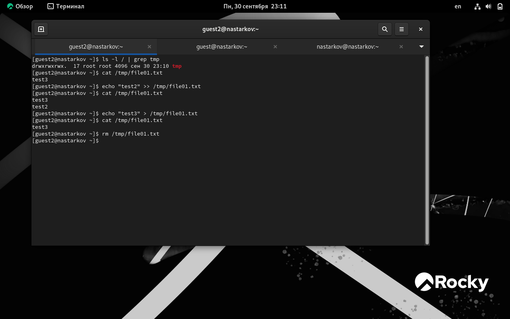

14) Вернули атрибут t+

## **Вывод**
В ходе выполнения лабораторной работы №7 я развил навыки применения режима однократного гаммирования.

