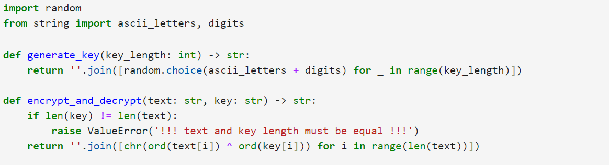
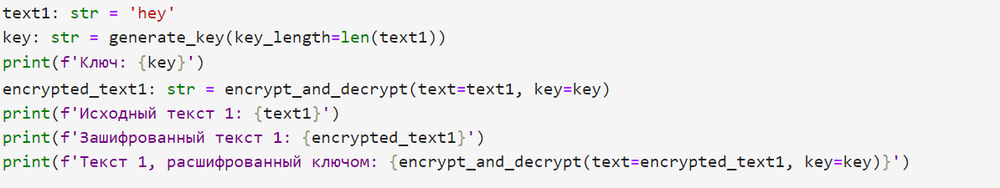
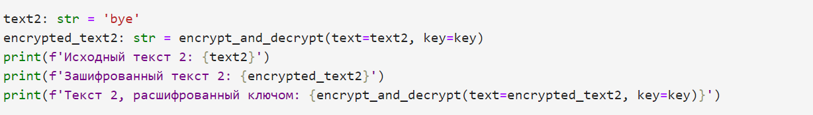
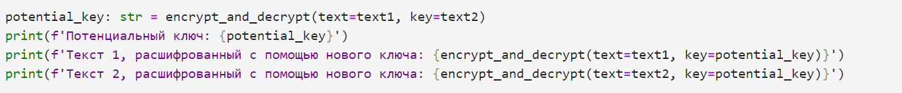
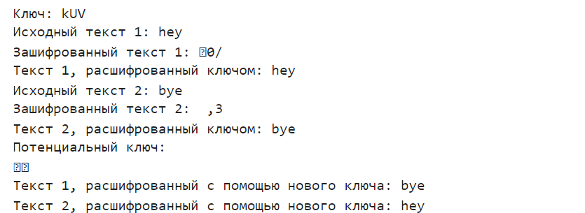

---
## Front matter
lang: ru-RU
title: Презентация к лабораторной работе №8
author: Старков Н.А
group: НПМбд-02-21

## Formatting
toc: false
slide_level: 2
theme: metropolis
header-includes: 
 - \metroset{progressbar=frametitle,sectionpage=progressbar,numbering=fraction}
 - '\makeatletter'
 - '\beamer@ignorenonframefalse'
 - '\makeatother'
aspectratio: 43
section-titles: true
---

# Презентация к лабораторной работе №8

# Цель работы

Освоить на практике применение режима однократного гаммирования на примере кодирования различных исходных текстов одним ключом

# Выполнение работы

## Начало кода

## Написание кода для проверки текста 1  текста 2

## Написание кода для потенциального ключа

## Проверка результатов 

# Вывод 

В ходе выполнения лабораторной работы №8 я развил навыки применения режима однократного гаммирования на примере кодирования различных исходных текстов одним ключом.