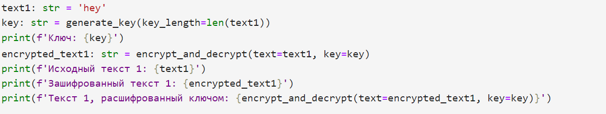
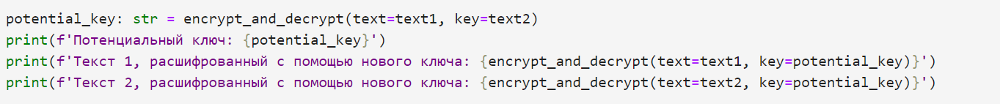
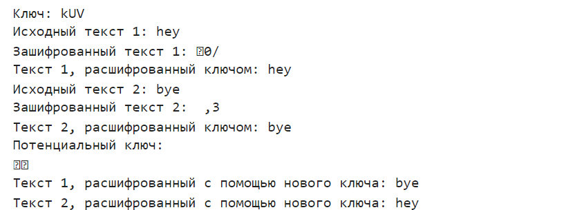

# **Отчет к лабораторной работе №8**
## **Common information**
discipline: Основы информационной безопасности  
group: НПМбд-02-21  
author: Старков Н.А.
---
---
## **Цель работы**

Освоить на практике применение режима однократного гаммирования на примере кодирования различных исходных текстов одним ключом

## **Выполнение работы**

Напишем код на языке программирования Python, воспользовавшись функциями из предыдущей лабораторной работы (для генерации ключа заданной длины и шифрования/дешифрования):


Возьмем два текста равной длины, сгенерируем для них один ключ, получим зашифрованные тексты и проверим корректность дешифрования:




Теперь получим потенциальный ключ для дешифрования текстов, применив посимвольно XOR (исключающее ИЛИ) для текстов (данная логика реализована в функции для шифрования/дешифрования).





Теперь, получив ключ, мы можем применить его для расшифрования текстов. Особенность данного подхода в том, что в силу определения операции XOR применение нового ключа к первому шифротексту дает содержимое второго текста, а примение ко второму - первого.

В итоге имеем данную программу:

```Python
import random
from string import ascii_letters, digits

def generate_key(key_length: int) -> str:
    return ''.join([random.choice(ascii_letters + digits) for _ in range(key_length)])

def encrypt_and_decrypt(text: str, key: str) -> str:
    if len(key) != len(text):
        raise ValueError('!!! text and key length must be equal !!!')
    return ''.join([chr(ord(text[i]) ^ ord(key[i])) for i in range(len(text))])

text1: str = 'hey'
key: str = generate_key(key_length=len(text1))
print(f'Ключ: {key}')
encrypted_text1: str = encrypt_and_decrypt(text=text1, key=key)
print(f'Исходный текст 1: {text1}')
print(f'Зашифрованный текст 1: {encrypted_text1}')
print(f'Текст 1, расшифрованный ключом: {encrypt_and_decrypt(text=encrypted_text1, key=key)}')

text2: str = 'bye'
encrypted_text2: str = encrypt_and_decrypt(text=text2, key=key)
print(f'Исходный текст 2: {text2}')
print(f'Зашифрованный текст 2: {encrypted_text2}')
print(f'Текст 2, расшифрованный ключом: {encrypt_and_decrypt(text=encrypted_text2, key=key)}')

potential_key: str = encrypt_and_decrypt(text=text1, key=text2)
print(f'Потенциальный ключ: {potential_key}')
print(f'Текст 1, расшифрованный с помощью нового ключа: {encrypt_and_decrypt(text=text1, key=potential_key)}')
print(f'Текст 2, расшифрованный с помощью нового ключа: {encrypt_and_decrypt(text=text2, key=potential_key)}')
```

## **Ответы на контрольные вопросы**

1) Для определения другого текста ($P_2$) можно просто взять зашифрованные тексты $C_1 ⊕ C_2$, далее применить XOR к ним и к известному тексту: $C_1 ⊕ C_2 ⊕ P_1 = P_2$.

2) При повторном использовании ключа мы получим дешифрованный текст.

3) Режим шифрования однократного гаммирования одним ключом двух открытых текстов осуществляется путем XOR-ирования каждого бита первого текста с соответствующим битом ключа или второго текста.

4) Недостатки шифрования одним ключом двух открытых текстов включают возможность раскрытия ключа или текстов при известном открытом тексте. 

5) Преимущества шифрования одним ключом двух открытых текстов включают использование одного ключа для зашифрования нескольких сообщений без необходимости создания нового ключа и выделения на него памяти.

## **Вывод**
В ходе выполнения лабораторной работы №8 я развил навыки применения режима однократного гаммирования на примере кодирования различных исходных текстов одним ключом.


