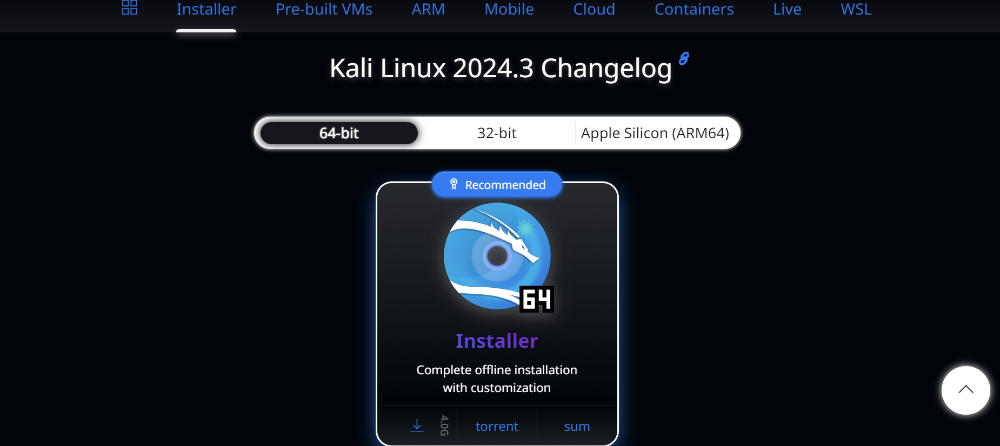
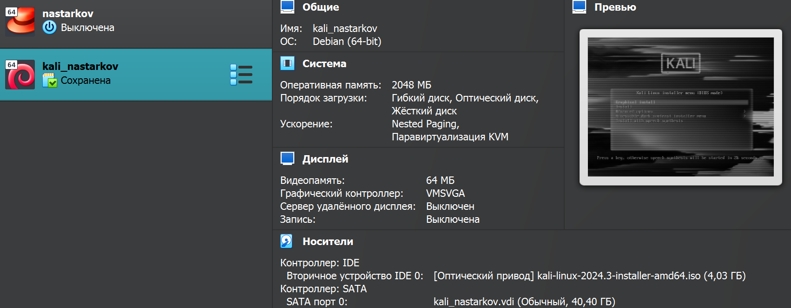
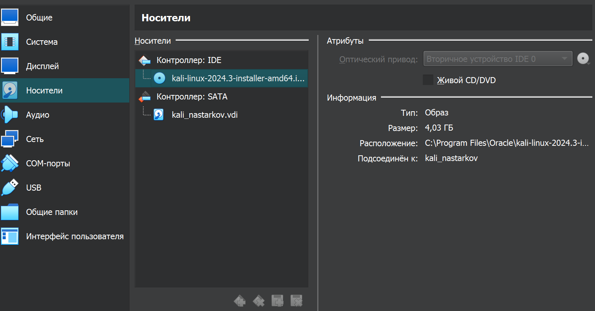
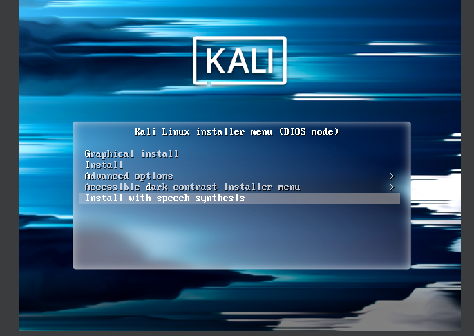
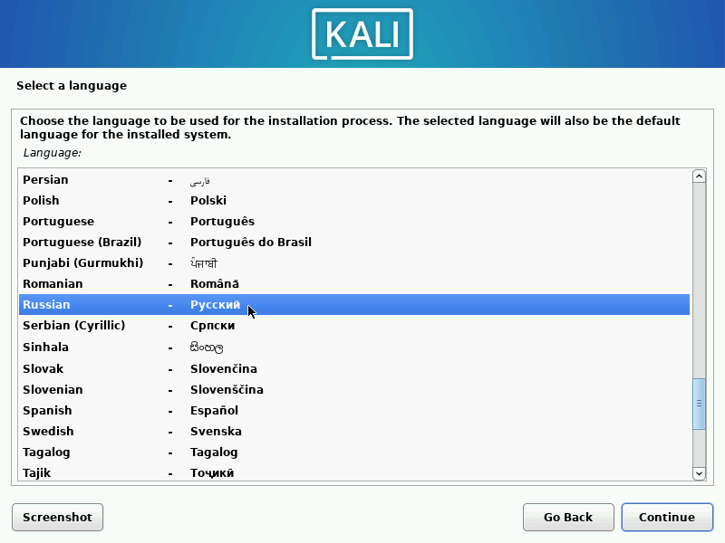
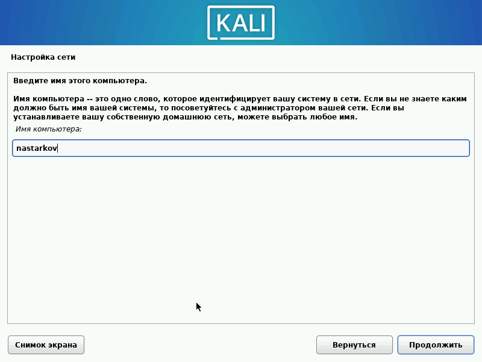
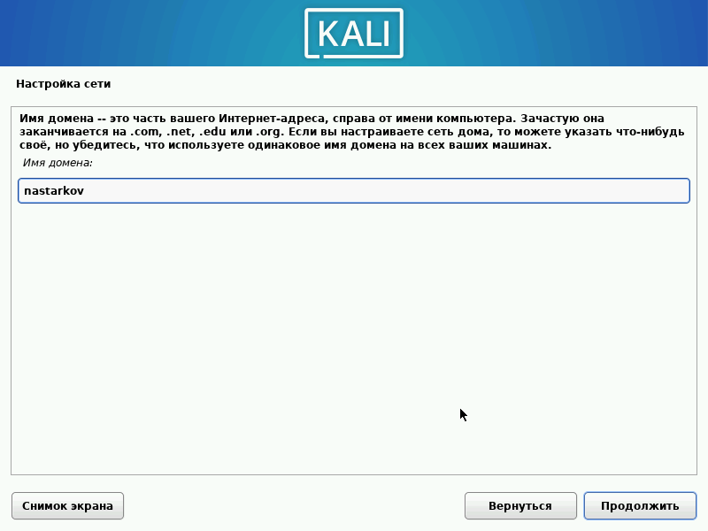
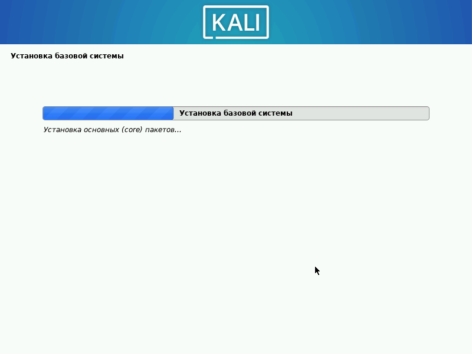
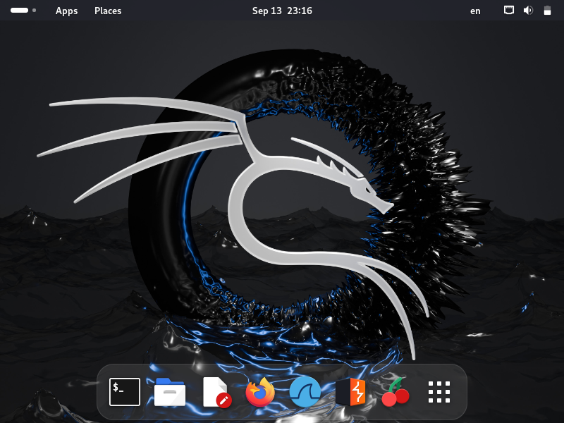

---
## Front matter
lang: ru-RU
title: Презентация по первому этапу проекта
author: Старков Н.А
group: НПМбд-02-21

## Formatting
toc: false
slide_level: 2
theme: metropolis
header-includes: 
 - \metroset{progressbar=frametitle,sectionpage=progressbar,numbering=fraction}
 - '\makeatletter'
 - '\beamer@ignorenonframefalse'
 - '\makeatother'
aspectratio: 43
section-titles: true
---

# Презентация по первому этапу проекта

# Цель работы

Установить дистрибутив Kali Linux.

# Выполнение работы

## Установка.

## Виртуальная машина.

## Необходимое ISO.

## Начало установки.

## Выбор языка.

## Первоначальная настройка.

## Продолжение настройки.

## Базовая система.

## Программное обеспечение.

## gdm3 и GRUB.

## Завершение.

## Вход в ОС.

# Вывод
В ходе выполнения первого этапа проекта я научился устанавливать дистрибутив Kali Linux на виртуальную машину.

