# **Отчет по первому этапу проекта**
## **Common information**
discipline: Основы информационной безопасности  
group: НПМбд-02-21  
author: Старков Н.А.
---
---
## **Цель работы**

Установить дистрибутив Kali Linux.

## **Выполнение работы**

1) Устанавливаем с официального сайта iso Kali Linux.

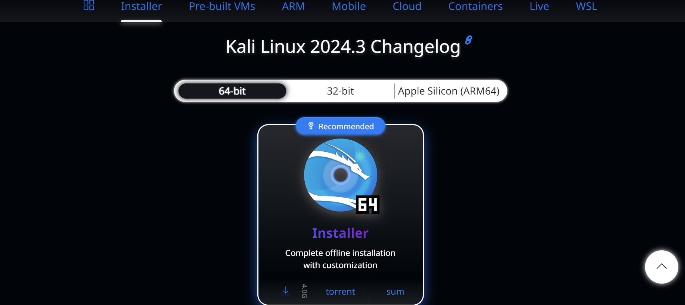

2) Создаем виртуальное машину с теми же настройками, что и в Лабораторной работе №1.

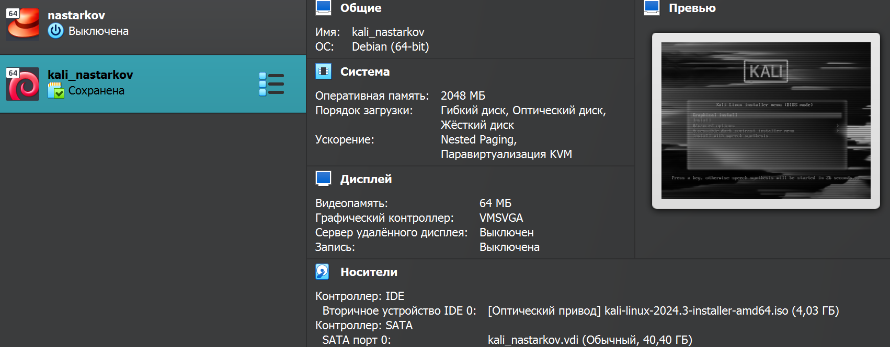

3) Выставляем необходимое iso.

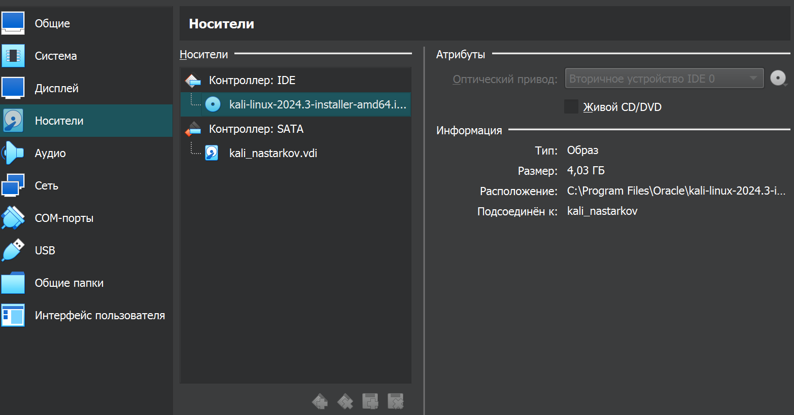

4) Начинаем устанавливать.

5) Выбираем необходимый язык.

6) Задаем первоначальные настройки для нашего будушего компьютера.

7) Продолжаем выставлять необходимые настройки.

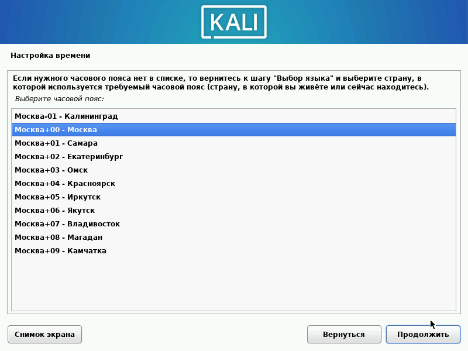

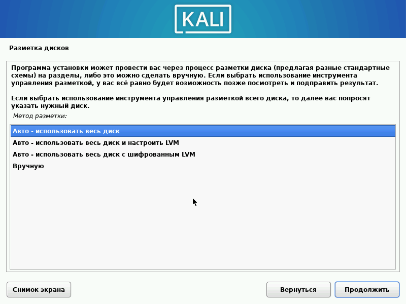

8) Ждем установку базовой системы.

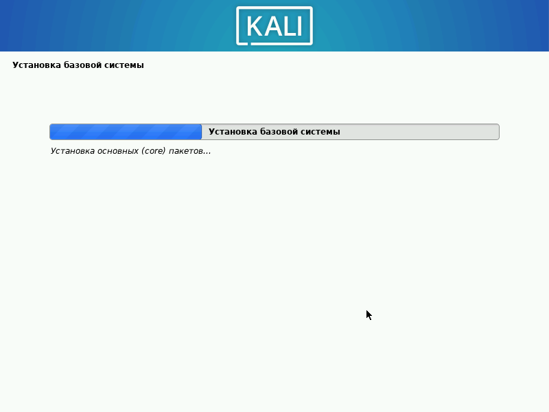

9) Выбираем программное обеспечение.

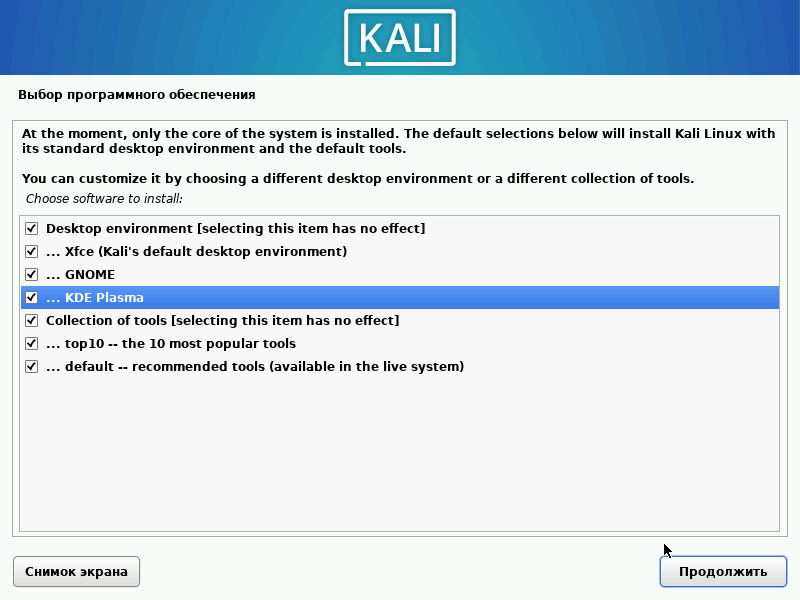

10) Настраиваем gdm3 и выбираем системный загрузчик.

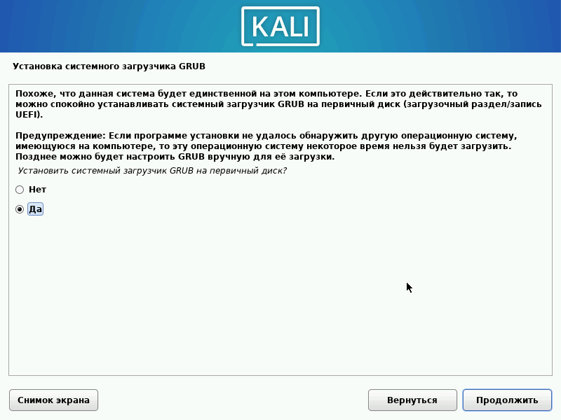

11) Ожидаем завершения загрузки.

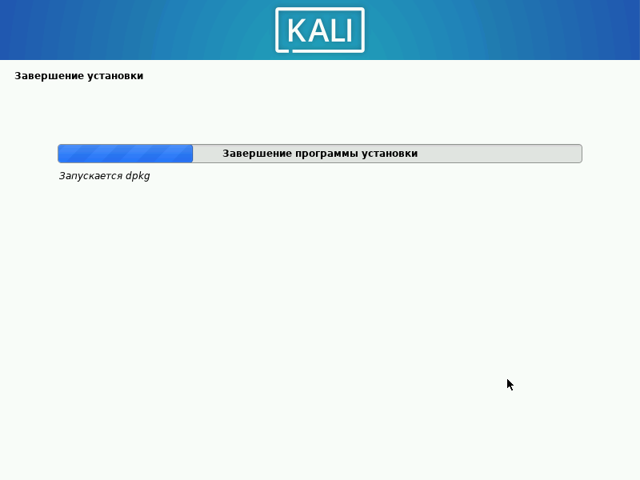

12) Заходим в систему.

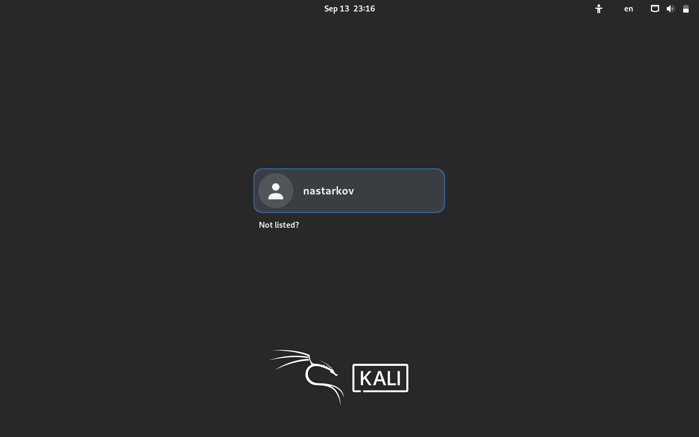

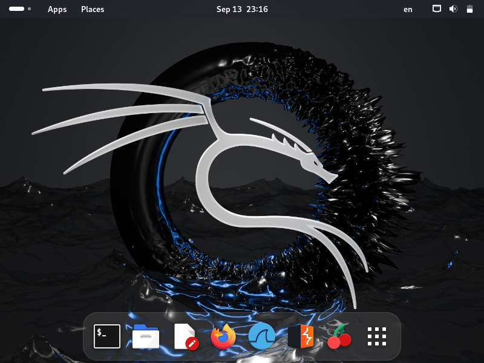

## **Вывод**
В ходе выполнения первого этапа проекта я научился устанавливать дистрибутив Kali Linux на виртуальную машину.

