---
## Front matter
lang: ru-RU
title: Презентация по второму этапу проекта
author: Старков Н.А
group: НПМбд-02-21

## Formatting
toc: false
slide_level: 2
theme: metropolis
header-includes: 
 - \metroset{progressbar=frametitle,sectionpage=progressbar,numbering=fraction}
 - '\makeatletter'
 - '\beamer@ignorenonframefalse'
 - '\makeatother'
aspectratio: 43
section-titles: true
---

# Презентация по второму этапу проекта

# Цель работы

Приобретение практического навыка установки и развертывания веб-приложения DVWA в гостевую систему к Kali Linux.

# Выполнение работы

## Клонируем репозиторий

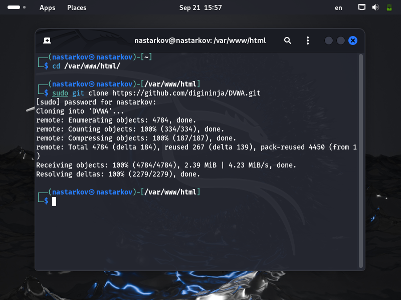

## Копирование файла config.inc.php.dist в файл config.inc.php

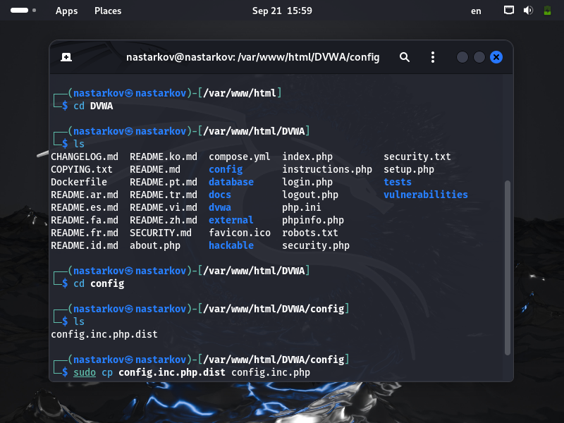

## Открытие и просмотр файла

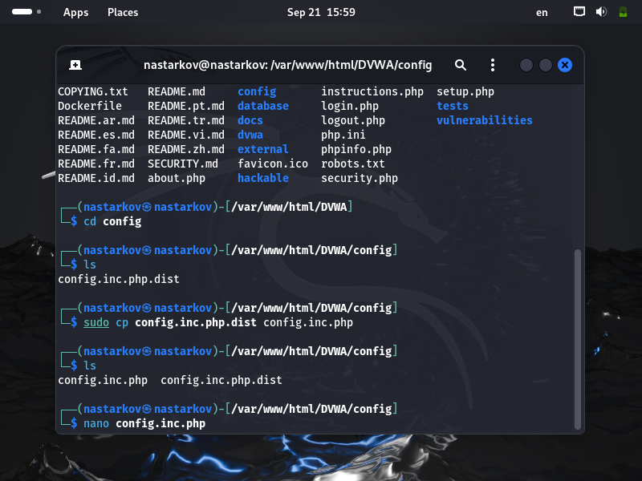

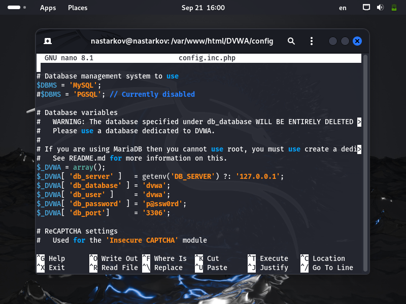

## Запуск СУБД

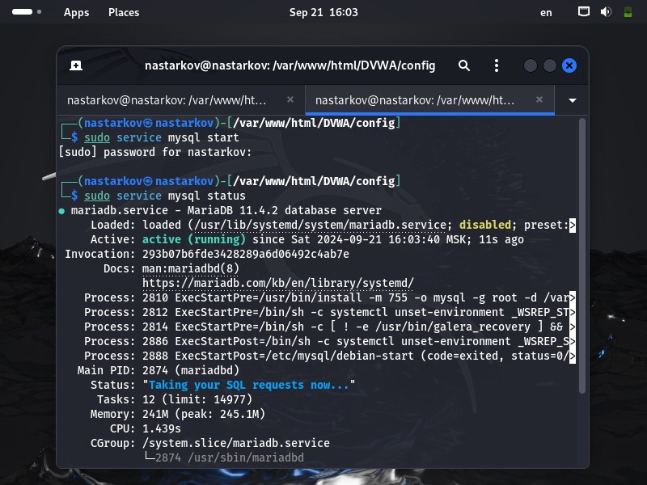

## Создание СУБД

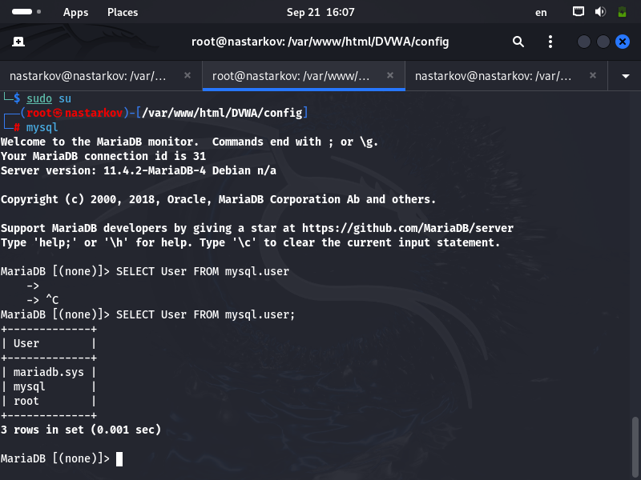

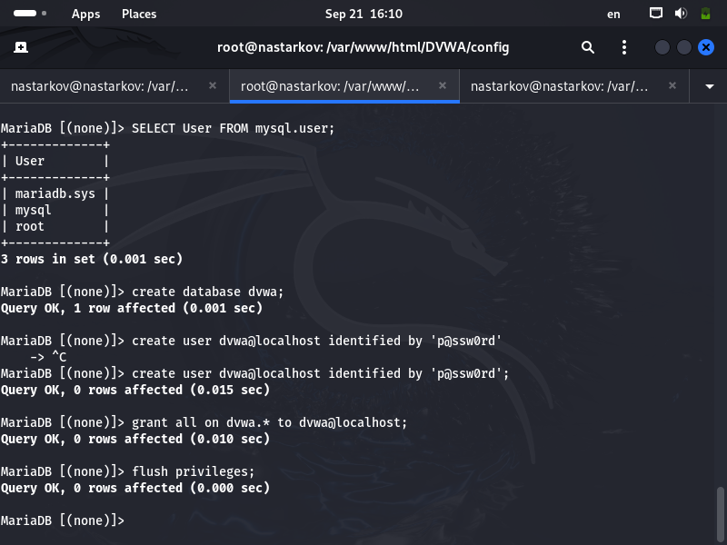

## Создание СУБД

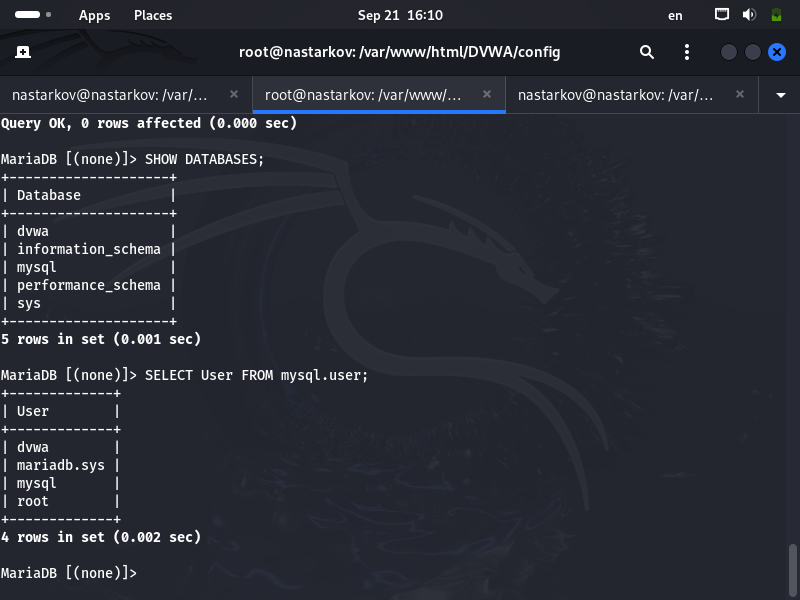

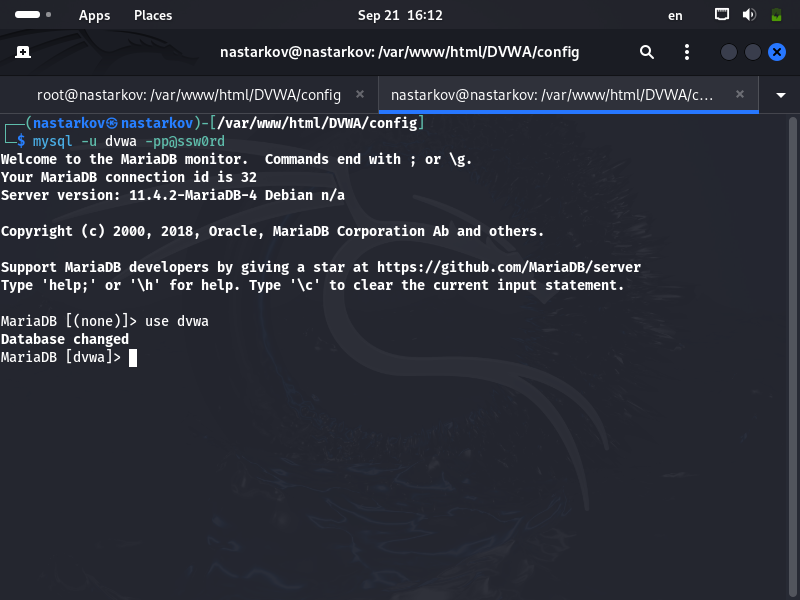

## Настройка apache2

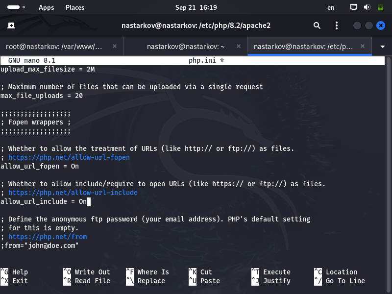

## Запуск

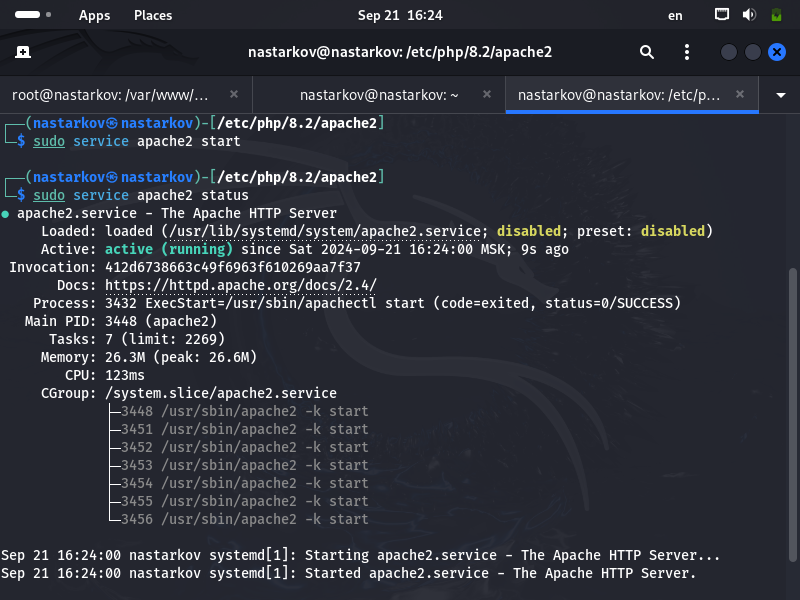

## Заходим в профиль.

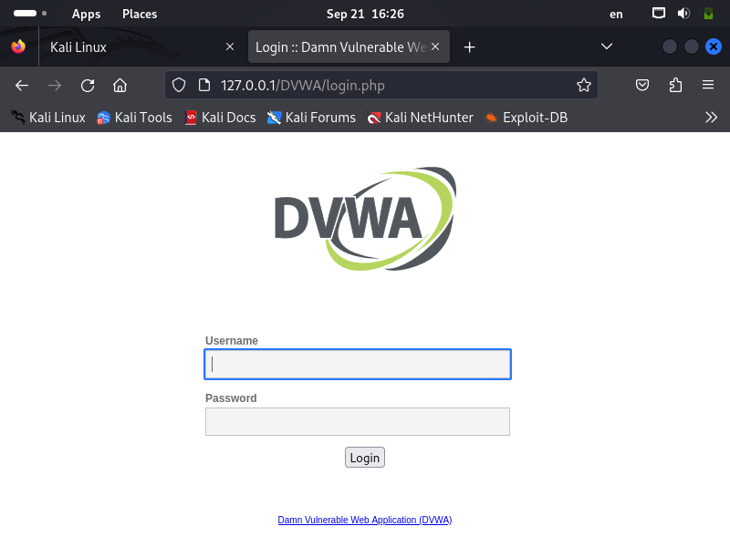

## Кнопка создания СУБД

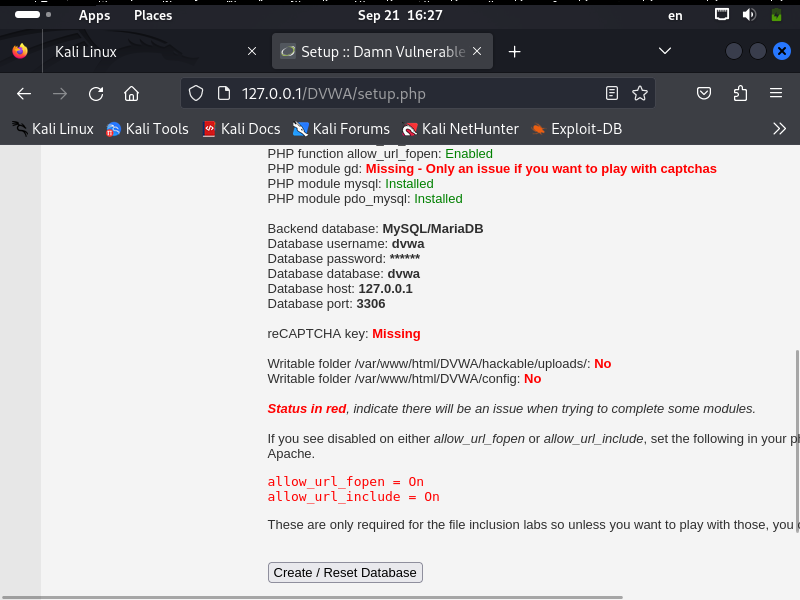

## Развернутое приложение

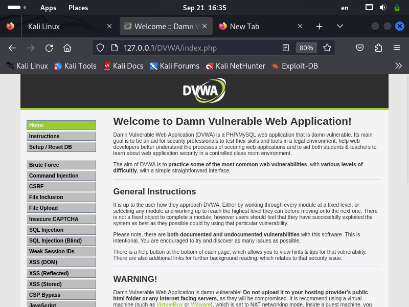

# Вывод

В ходе выполнения второго этапа проекта я получил практический навык установки и развертывания веб-приложения DVWA в гостевую систему к Kali Linux.
