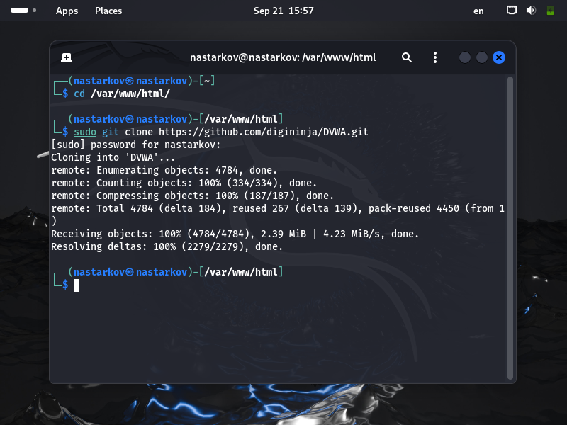
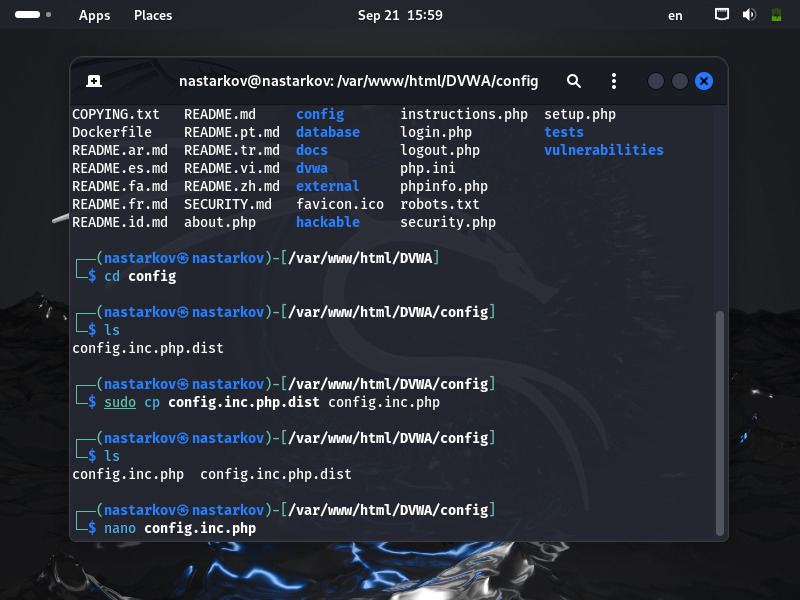
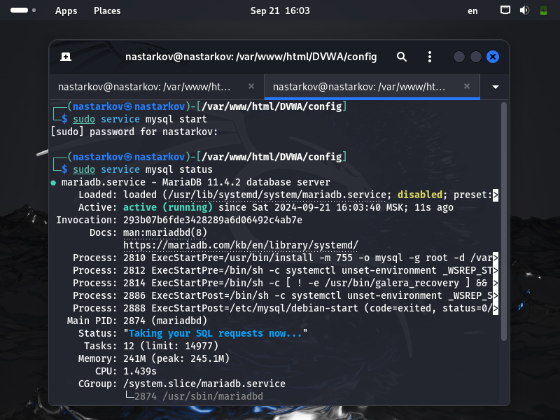
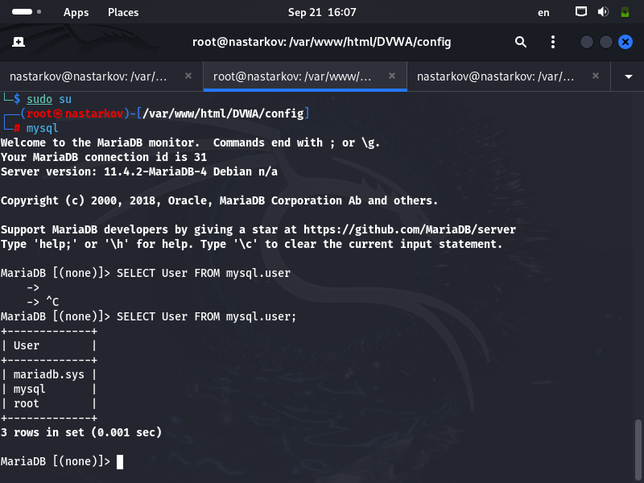
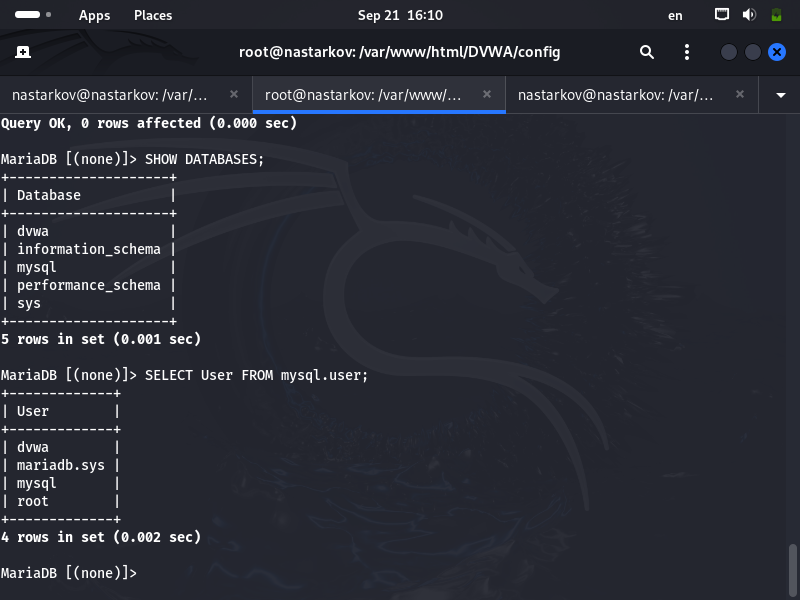
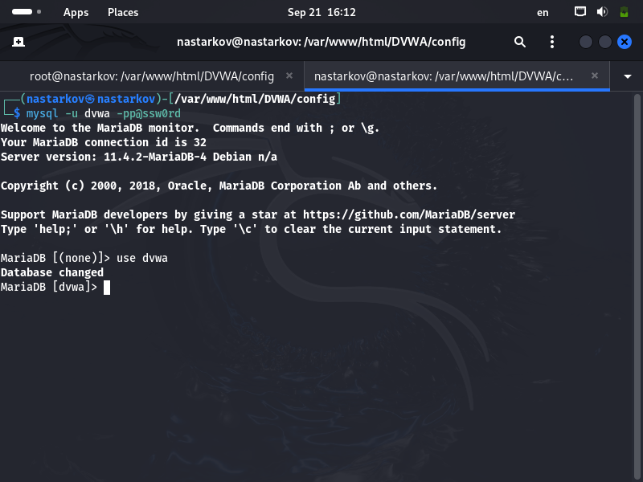
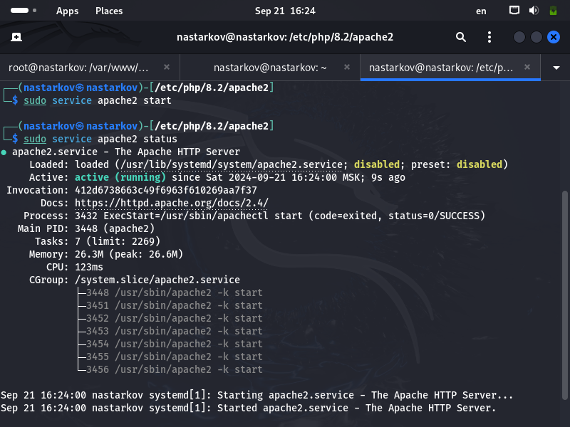

# **Отчет по второму этапу проекта**
## **Common information**
discipline: Основы информационной безопасности  
group: НПМбд-02-21  
author: Старков Н.А.
---
---
## **Цель работы**

Приобретение практического навыка установки и развертывания веб-приложения DVWA в гостевую систему к Kali Linux.

## **Выполнение работы**

1) Перейдем в директорию /var/www/html/ и склонируем репозиторий https://github.com/digininja/DVWA.git



2) Перейдем в директорию config и скопируем содержимое файла config.inc.php.dist в файл 
config.inc.php командой

```
cp config.inc.php.dist config.inc.php
```


3) Откроем файл командой

```
nano  config.inc.php
```




4) Как видим, файл содержит конфигурацию для подключения к СУБД MySQL как к СУБД по умолчанию.

Запускаем СУБД командой и смотрим работу следующими командами:

```
sudo service mysql start
```

```
sudo service mysql status
```



5) Теперь перейдем к созданию базы данных и пользователя в соответствии с файлом config.inc.php:








6) После мы должны внести изменение в конфигурационный файл php.ini веб-сервера apache2.

Для корректной работы переменные allow_url_include и allow_url_fopen должны иметь значение On.


7) Запустим процесс веб-сервера аналогично MySQL: 



8) Теперь перейдем по адресу 127.0.0.1/DVWA/login.php. В форму авторизации введем  имя пользовтеля admin и пароль password:


9) Перейдя на страницу приложения, прокрутим ее вниз до кнопки "Create / Reset Database" и нажмем на нее, после чего авторизуемя повторно:


10) Веб-приложение DVWA развернуто.


## **Вывод**

В ходе выполнения второго этапа проекта я получил практический навык установки и развертывания веб-приложения DVWA в гостевую систему к Kali Linux.

