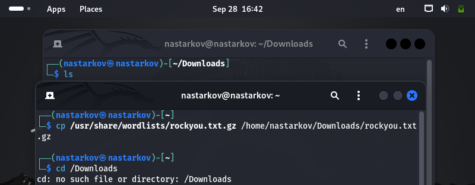
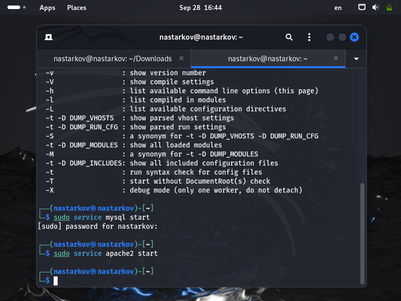
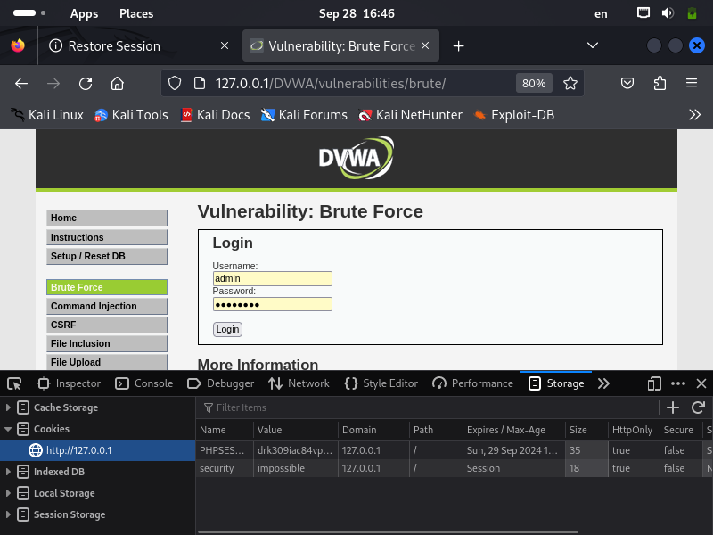
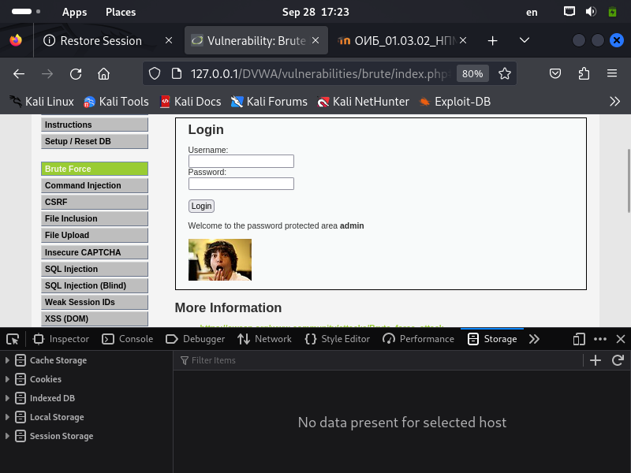

---
## Front matter
lang: ru-RU
title: Презентация по третьему этапу проекта
author: Старков Н.А
group: НПМбд-02-21

## Formatting
toc: false
slide_level: 2
theme: metropolis
header-includes: 
 - \metroset{progressbar=frametitle,sectionpage=progressbar,numbering=fraction}
 - '\makeatletter'
 - '\beamer@ignorenonframefalse'
 - '\makeatother'
aspectratio: 43
section-titles: true
---

# Презентация по третьему этапу проекта

# Цель работы

Приобретение практических навыков по использованию инструмента Hydra для брутфорса (подбора) паролей.

# Выполнение работы

## Скопировали файл с паролями

## Запустили сервисы

## Форма для взлома

## Необходимые переменные

## Hydra

## Авторизация

# Вывод

В ходе выполнения третьего этапа проекта я приобрел практический навык по использованию инструмента Hydra для брутфорса (подбора) паролей.
