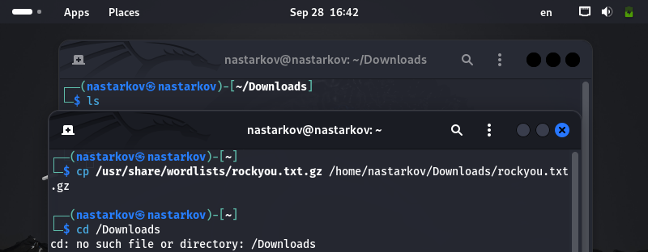
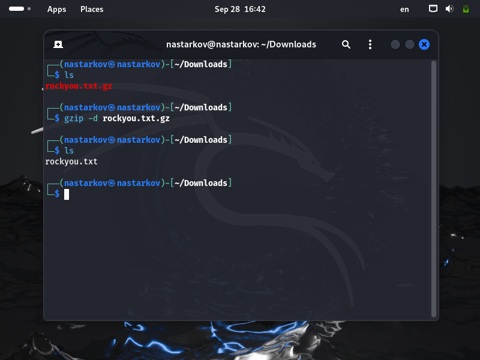
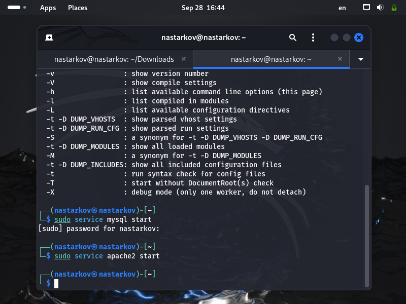
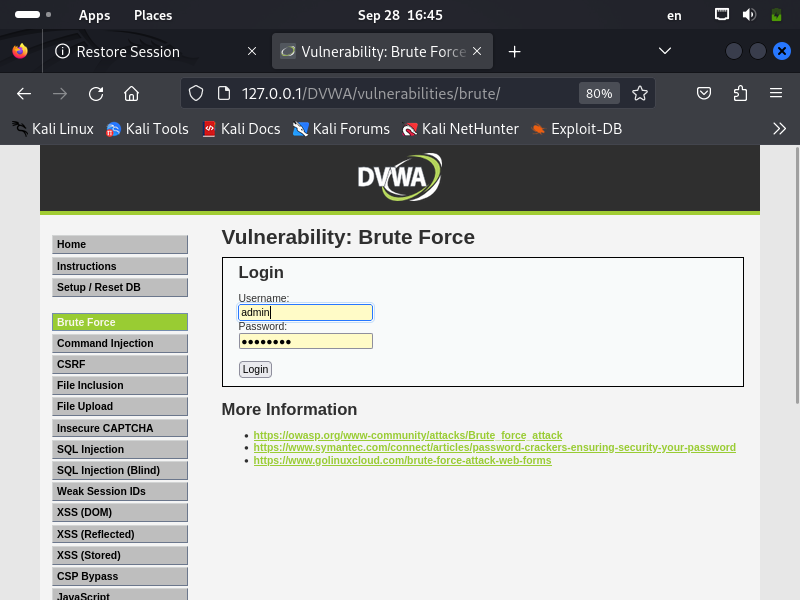
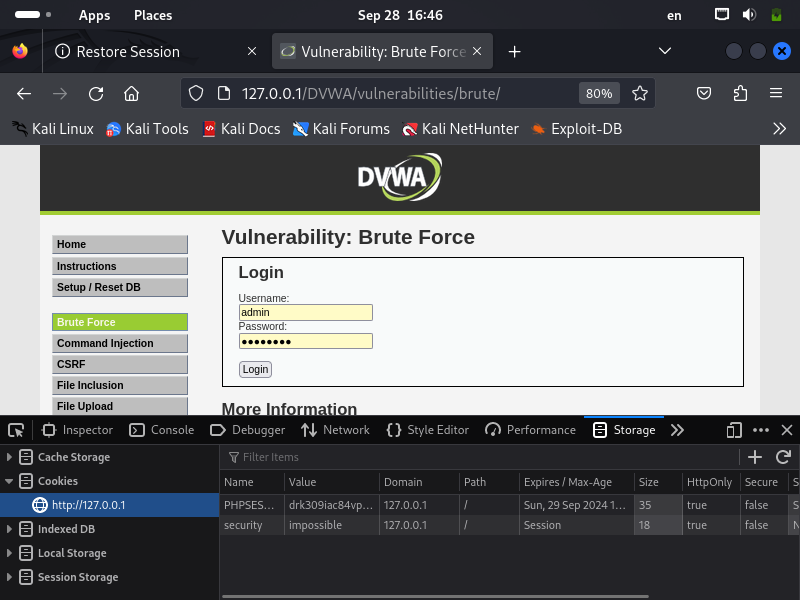
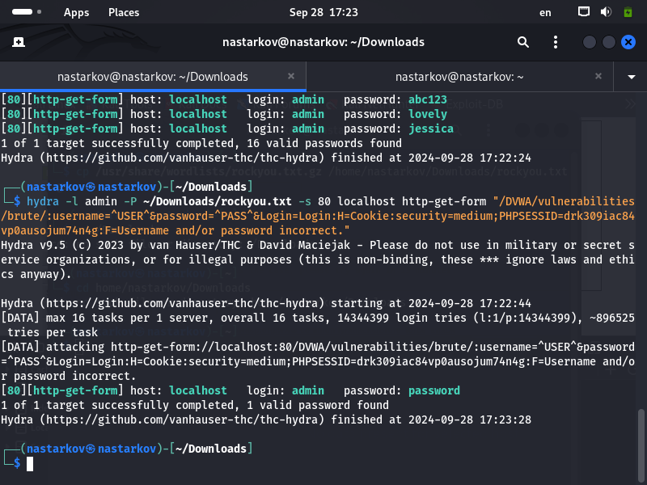
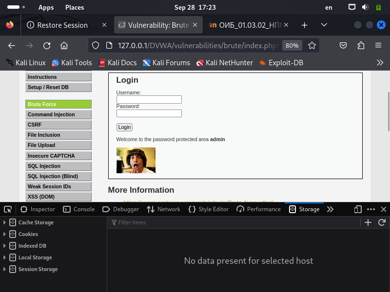

# **Отчет по третьему этапу проекта**
## **Common information**
discipline: Основы информационной безопасности  
group: НПМбд-02-21  
author: Старков Н.А.
---
---
## **Цель работы**

Приобретение практических навыков по использованию инструмента Hydra для брутфорса (подбора) паролей.

## **Выполнение работы**

1) Для перебора пароля нам нужен файл, их содержащий. Пример такого файла находится в директории /usr/share/wordlists/ в архиве rockyou.txt.gz.

Скопируем архив в директорию Downloads и разархивируем его:





2) Теперь откроем в браузере приложение DVWA, развернутое на прошлом этапе, не забыв предварительно запустить сервисы MySQL и Apache2:



3) Форма для взлома располагается в разделе Brute Force:



4) В форме имеются два тега input с атрибутами name, равными 'username' и 'password' соответственно.

Также нам могут пригодиться фрагменты-cookie нашего приложения. У нас это PHPSESSID и security:



5) Воспользуемся утилитой hydra, введя следующую команду:

```
hydra -l <login> -P <path_to_file> -s <port> <host> http-<method>-form "<url>:username=^USER^&password=^PASS^&Login=Login:H=Cookie:<key=value>;<key=value>:F=<error_message>"
```

где
* login - логин для авторизации (в нашем случае admin)
* path_to_file - путь до файла с паролями 

    (в нашем случае /home/amermolaev/Downloads/rockyou.txt)
* port - порт, по которому доступно приложение (в нашем случае 80)
* host - домен или ip приложения (в нашем случае localhost)
* method - метод запроса (в нашем случае get)
* url - адрес относительно корня сайта 

    (в нашем случае /DVWA/vulnerabilities/brute/)
* key=value - имена и значения cookie-переменных 

    (в нашем случае PHPSESSID и security)
* error_message - сообщение, выводимое при неверных логине и пароле

    (в нашем случае Username and/or password incorrect.)

В итоге команда имеет следующие опции:

```
hydra -l admin -P ~/Downloads/rockyou.txt -s 80 localhost http-get-form "/DVWA/vulnerabilities/brute/:username=^USER^&password=^PASS^&Login=Login:H=Cookie:security=impossible; PHPSESSID=drk309iac84vp@ausojum74n4g: F=Username and/or password incorrect."

```


6) Как видно, утилита подобрала пожходящий пароль.

Введем его в соответствующее поле и успешно авторизуемcя:




## **Вывод**

В ходе выполнения третьего этапа проекта я приобрел практический навык по использованию инструмента Hydra для брутфорса (подбора) паролей.

