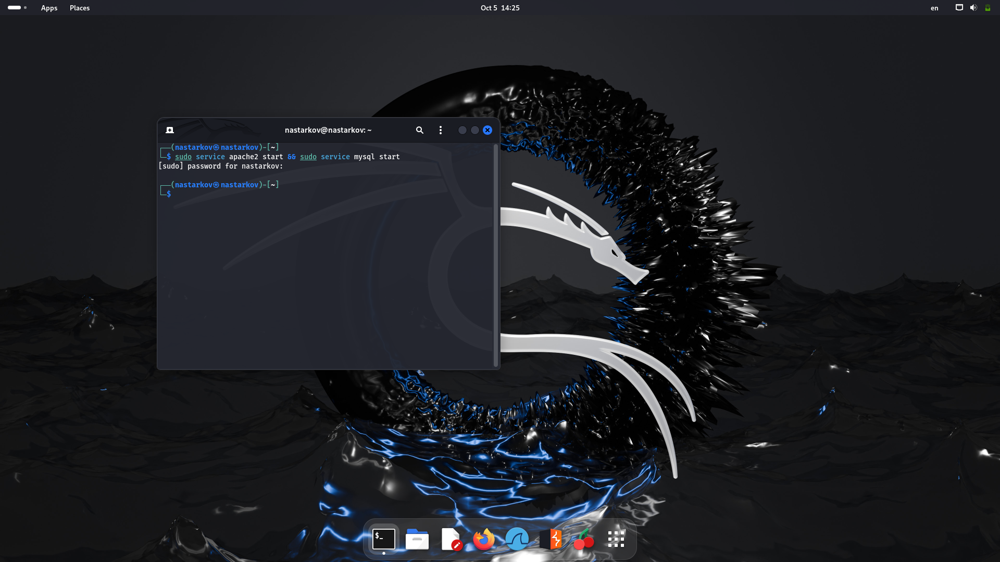
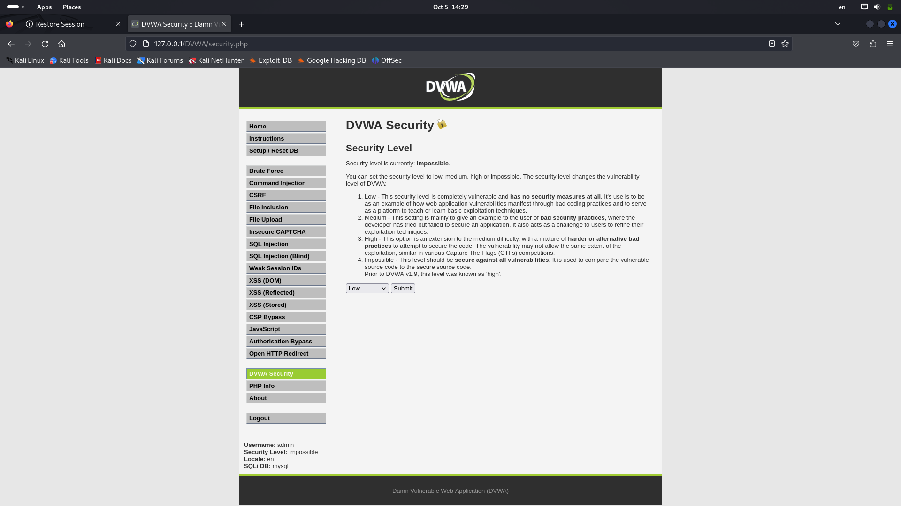
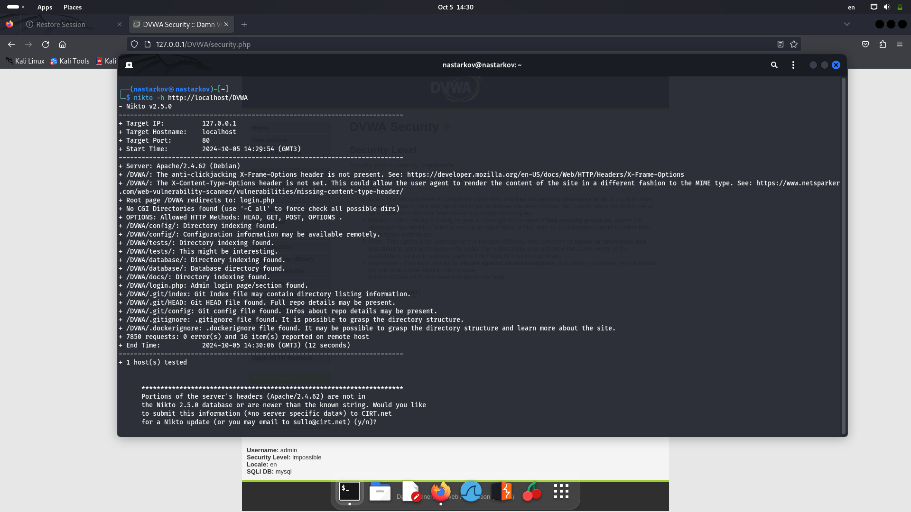
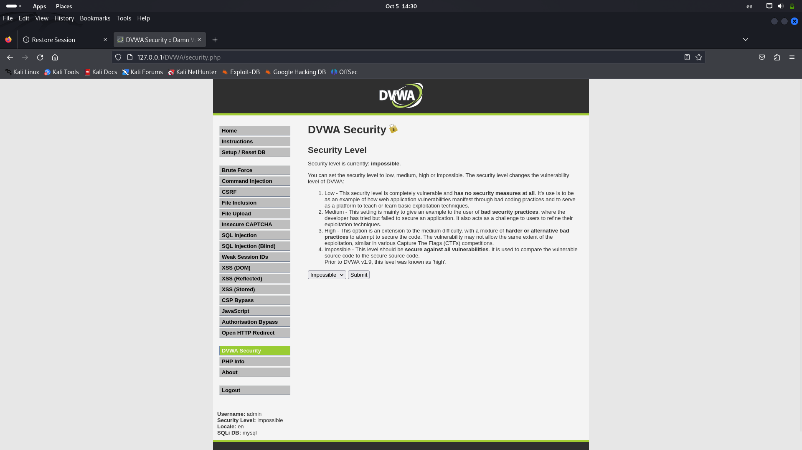
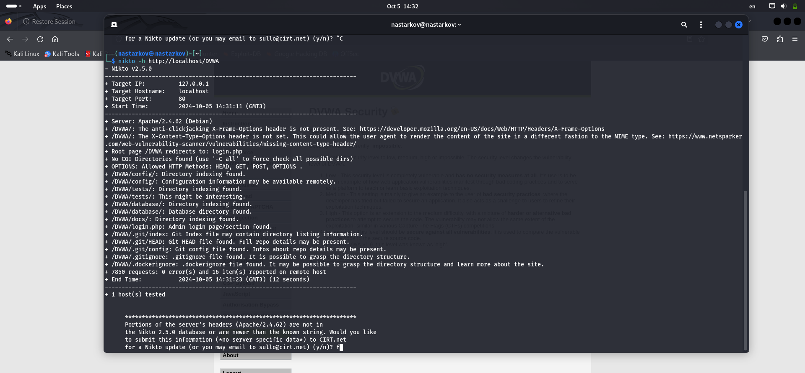

---
## Front matter
lang: ru-RU
title: Презентация по четвертому этапу проекта
author: Старков Н.А
group: НПМбд-02-21

## Formatting
toc: false
slide_level: 2
theme: metropolis
header-includes: 
 - \metroset{progressbar=frametitle,sectionpage=progressbar,numbering=fraction}
 - '\makeatletter'
 - '\beamer@ignorenonframefalse'
 - '\makeatother'
aspectratio: 43
section-titles: true
---

# Презентация по четвертому этапу проекта

# Цель работы

Приобретение практических навыков по использованию инструмента nikto - базового сканера безопасности веб-сервера.

# Выполнение работы

## Для работы приложения запустили сервисы Apache2 и MySQL

## Перешли в раздел DVWA Security. Выставили значение Low

## Утилита nikto

## Cмена значения на impossible

## Повторный запуск

# Вывод

В ходе выполнения четвертого этапа проекта я приобрел практические навыки по использованию инструмента nikto - базового сканера безопасности веб-сервера.
